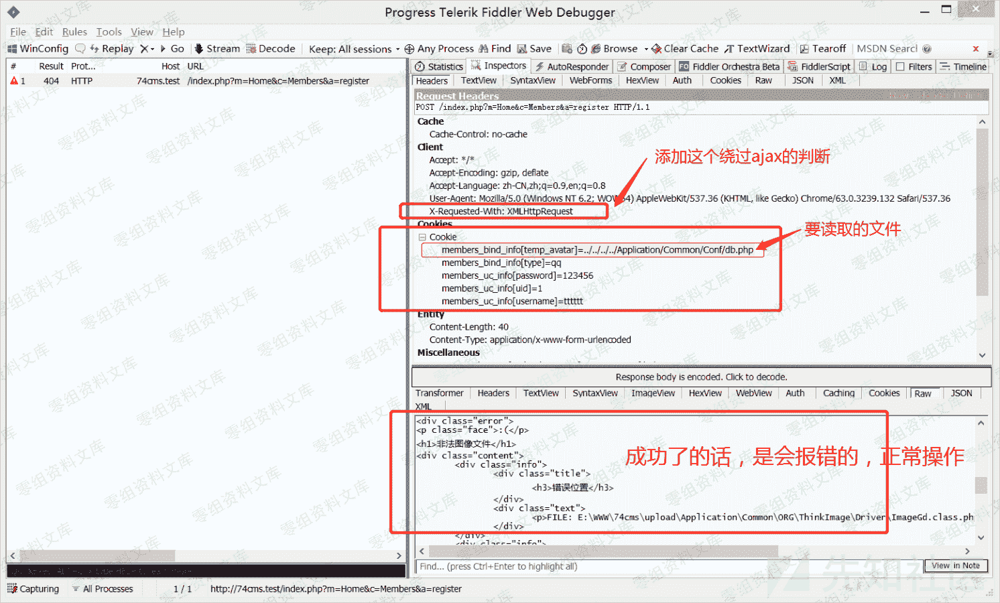
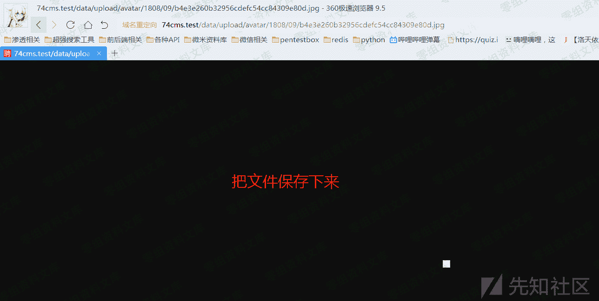
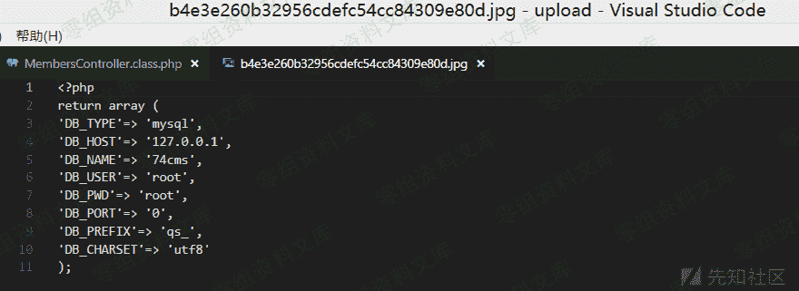
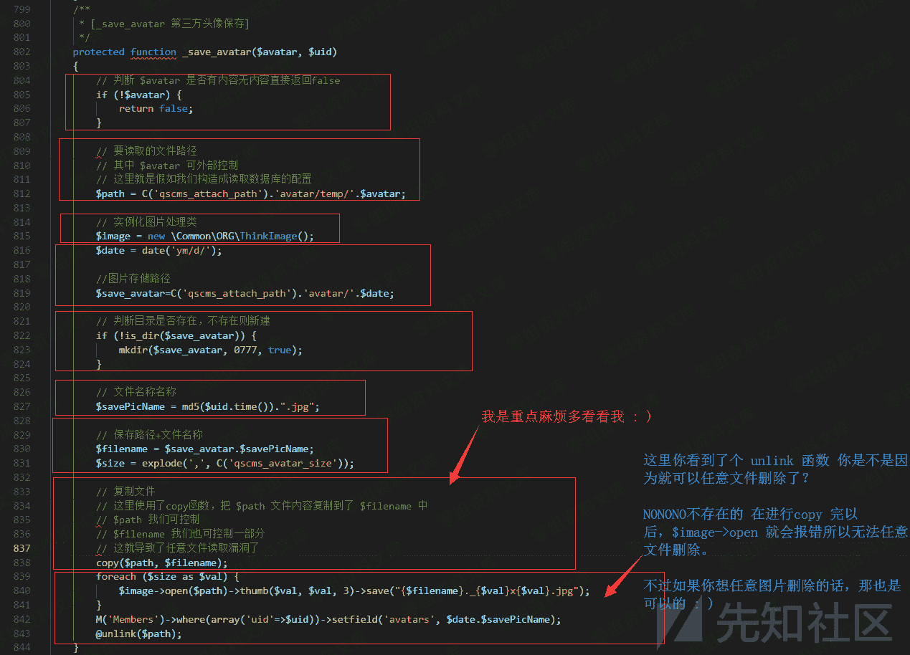
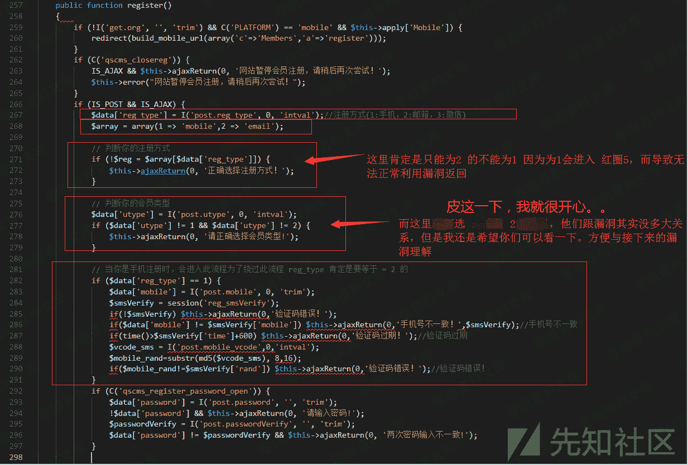
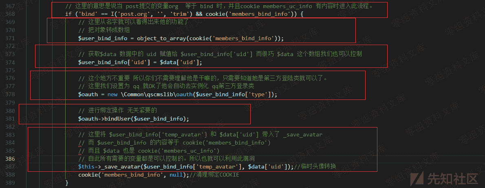

# 74cms v4.2.126-任意文件读取漏洞

> 原文：[http://book.iwonder.run/0day/74cms/新版 74cms v4.2.126-任意文件读取漏洞.html](http://book.iwonder.run/0day/74cms/新版 74cms v4.2.126-任意文件读取漏洞.html)

## 0x00 前言

厂商：74cms 下载地址：[http://www.74cms.com/download/index.html](http://www.74cms.com/download/index.html) 关于版本： 新版的 74cms 采用了 tp3.2.3 重构了，所以可知底层是 tp，74cms 新版升级是后台升级的，所以先将将升级方法。 注：此漏洞不用升级至最新版本也可使用。

## 0x01 74cms 升级到最新版

1， 先去官网下载 骑士人才系统基础版(安装包) 2， 将下载好的包进行安装 3， 进入后台点击查看如果不是最新版的话，请点击升级！ 4， 如果是本地环境的话，会提示 域名不合法升级失败，这个问题很好解决 5， 搜索文件 74cms\upload\Application\Admin\Controller\ApplyController.class.php 6， 查找所有$_SERVER['HTTP_HOST'] 改为 [http://baidu.com](http://baidu.com) 即可

## 0x02 任意文件读取漏洞演示

```
url: http://74cms.test/index.php?m=Home&c=Members&a=register

post: 
reg_type=2&utype=2&org=bind&ucenter=bind
cookie: members_bind_info[temp_avatar]=../../../../Application/Common/Conf/db.php;members_bind_info[type]=qq;members_uc_info[password]=123456;members_uc_info[uid]=1;members_uc_info[username]=tttttt;
headers:
Content-Type: application/x-www-form-urlencoded
X-Requested-With: XMLHttpRequest 
```








问题一：漏洞原理？ 我下面会讲 问题二：你如何知道文件名称的？ 我下面会讲 问题三：能不能写个简单的工具，自动利用此漏洞？ 哦，好的，我下面会提供 : )

## 0x03 漏洞讲解

打开文件：74cms\upload\Application\Home\Controller\MembersController.class.php 函数：_save_avatar($avatar, $uid)



如果不想看图片注释的话，我这里简单的说一下。 812 行使用$avatar 拼接形成$path 830 行使用了$save_avatar+$savePicName; 生成了$filename 838 行，使用了 copy 函数，把$path 文件内容复制到了$filename 中。 而 $avatar 和 $uid 都是我们刚好可以控制的变量 并且生成的文件名称是$uid+time() 然后 md5 一下 拼接 .jpg 这个情况就很舒服了。写个小工具跑一下就好了，小工具会在结尾的时候放出来的。 好了，让我们继续看下去 : ) 我们现在既然已经知道了 _save_avatar 函数是有可能造成此漏洞的那么这时，我们就需要去找调用它的地方了。 经过一顿的搜索我们得出了两个地方是调用了他 地方一：register() 方法 会员注册方法 地方二：oauth_reg() 方法 第三方登录注册方法 论此漏洞的利用当然是 register() 方法利用起来比较简单 因为 方法二 需要搭建第三方登录，我本地的话。。。还是算了，这里掩饰我使用 方法一 打开文件：74cms\upload\Application\Home\Controller\MembersController.class.php 函数：register()



上面的马赛克是因为我写错了几个字，又不想重新写，所以我就把他擦掉了。 皮这一下，我就很开心


这里我们讲解一下如果 post 的变量 ucenter 为 bind 时，则通过 cookie 获取数组$uc_user 接着会进行数组合并而 members_uc_info 的 cookie 值是可控的，所以$data 也是可控的。


这里写着 当 $data[utype] = 1 会进行用户注册，而$data[utype]是我们可以控制的所以我们为 2 绕过此判断 这里我又跳过了前面一些无关紧要的内容，来到了最后的漏洞触发点。因为真的无关紧要,所以就跳过了



## 0x04 漏洞利用小工具

[https://github.com/ianxtianxt/74cms-upload](https://github.com/ianxtianxt/74cms-upload)


## 四、参考链接

> [https://www.yuque.com/pmiaowu/bfgkkh/dr895b](https://www.yuque.com/pmiaowu/bfgkkh/dr895b)

