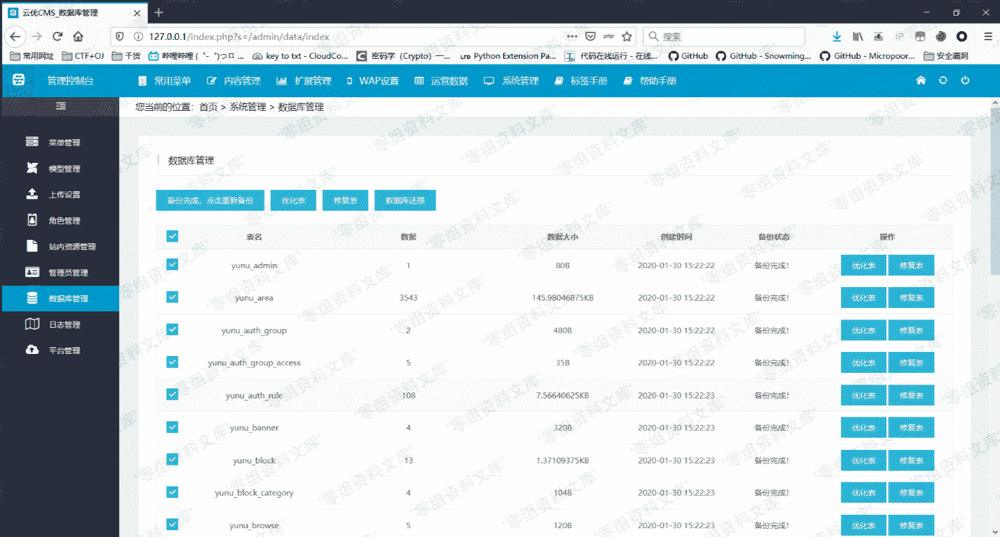
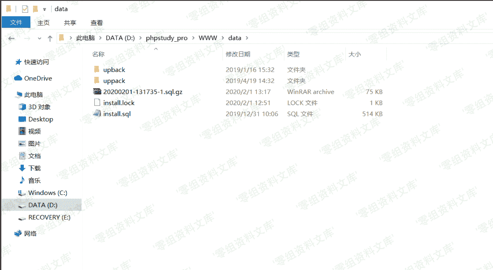
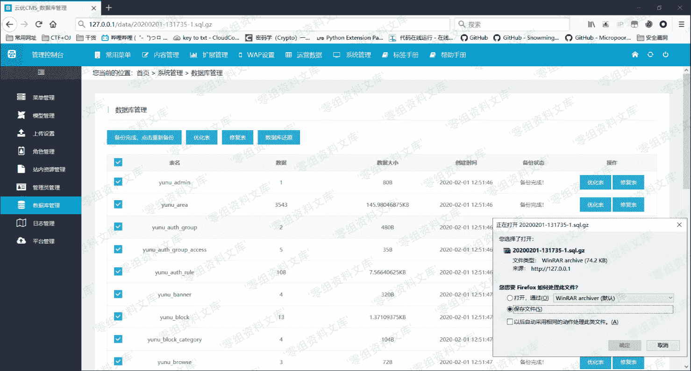
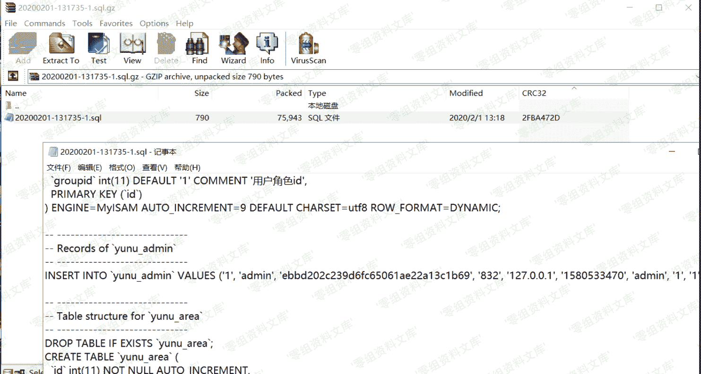

# Yunucms v2.0.7 数据库泄露

> 原文：[http://book.iwonder.run/0day/Yunucms/2.html](http://book.iwonder.run/0day/Yunucms/2.html)

## 一、漏洞简介

云优 CMS 是一款基于 TP5.0 框架为核心开发的一套免费+开源的城市分站内容管理系统。云优 CMS 前身为远航 CMS。云优 CMS 于 2017 年 9 月上线全新版本，二级域名分站，内容分站独立，七牛云存储，自定义字段，自定义表单，自定义栏目权限，自定义管理权限等众多功能深受用户青睐。

## 二、漏洞影响

Yunucms v2.0.7

## 三、复现过程

### 漏洞分析

```
POST /index.php?s=/admin/data/export HTTP/1.1

public function export($ids = null, $id = null, $start = null) {
        $Request = Request::instance();
        if ($Request->isPost() && !empty($ids) && is_array($ids)) { //初始化
            $path = config('data_backup_path');
            is_dir($path) || mkdir($path, 755, true);
            //读取备份配置
            $config = [
                'path' => realpath($path) . DIRECTORY_SEPARATOR,
                'part' => config('data_backup_part_size'),
                'compress' => config('data_backup_compress'),
                'level' => config('data_backup_compress_level'),
            ];

            //检查是否有正在执行的任务
            $lock = "{$config['path']}backup.lock";
            if (is_file($lock)) {
                return $this->error('检测到有一个备份任务正在执行，请稍后再试，或手动删除"'.$lock.'"后重试！');
            }
            file_put_contents($lock, $Request->time()); //创建锁文件
            //检查备份目录是否可写
            is_writeable($config['path']) || $this->error('备份目录不存在或不可写，请检查后重试！');
            session('backup_config', $config);

            //生成备份文件信息
            $file = [
                'name' => date('Ymd-His', $Request->time()),
                'part' => 1,
            ];
            session('backup_file', $file);
            //缓存要备份的表
            session('backup_tables', $ids);

            //创建备份文件
            $Database = new \com\Database($file, $config);
            if (false !== $Database->create()) {
                $tab = ['id' => 0, 'start' => 0];
                return $this->success('初始化成功！', '', ['tables' => $ids, 'tab' => $tab]);
            } else {
                return $this->error('初始化失败，备份文件创建失败！');
            }
        }
...... 
```

可以看到，备份文件的命名用的 time 方法，跟进

```
public function time($float = false)
    {
        return $float ? $_SERVER['REQUEST_TIME_FLOAT'] : $_SERVER['REQUEST_TIME'];
    } 
```

可以看到利用 REQUEST_TIME 进行构造文件名，因此可以直接爆破得到并下载。

### 漏洞复现

在后台系统管理->数据库管理模块将所有数据库备份



查看本地文件，所有备份保存在 data 目录下，发现名命是以时间命名，可以直接爆破得到



从前台访问并下载



下载完成后打开，泄露所有数据库信息



