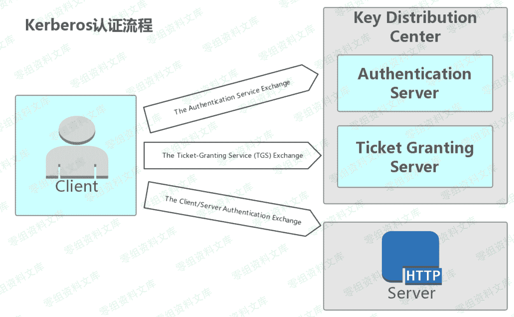
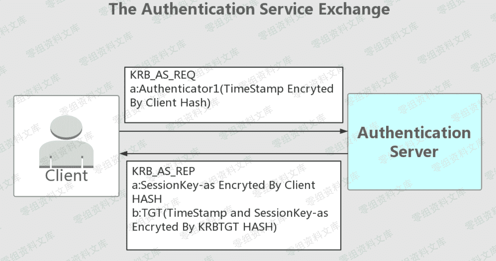
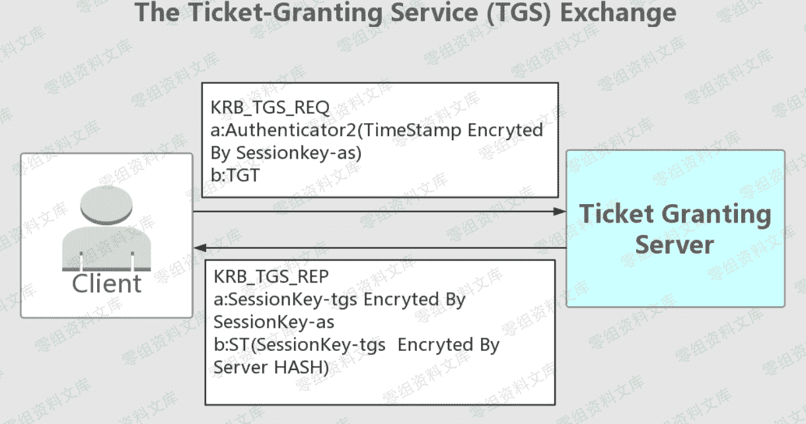
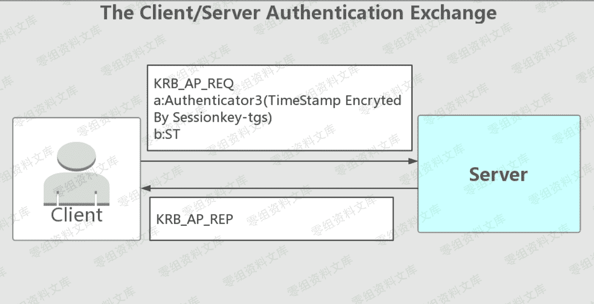

> 原文：[http://book.iwonder.run/域渗透/2.2.html](http://book.iwonder.run/域渗透/2.2.html)

## 2.2 Kerberos 认证流程

当 Client 想要访问 Server 上的某个服务时，需要先向 AS 证明自己的身份，然后通过 AS 发放的 TGT 向 Server 发起认证请求，这个过程分为三块:

*   The Authentication Service Exchange: Client 与 AS 的交互
*   The Ticket Granting Service Exchange:Client 与 TGS 的交互
*   The Client/Server Authentication Exchange:Client 与 Server 的交互

#### (1) The Authentication Service Exchange

##### KRB_AS_REQ:

> Client->AS:发送 Authenticator1(Client 密码加密 TimeStamp)

第一步 Client 先向 KDC 的 AS 发送 Authenticator1,内容为通过 Client 密码 hash 加密的时间戳、Client ID、网络地址、加密类型等内容。

##### KBR_AS_REP:

> AS->Client:发送 Client 密码加密的 sessionkey-as 和票据 TGT(KBRTGT HASH 加密的 sesionkey-as 和 Timestamp)

在 KDC 中存储了域中所有用户的密码 hash，当 AS 接受到 Client 的请求后会根据 KDC 中存储的密码来解密，解密成功并且验证信息。验证成功后返回给 Client 由 Client 密码 hash 加密的 sessionkey-as 和 TGT(由 KBRTGT HASH 加密的 sessionkey-as 和 Timestamp 等信 息)。

#### (2) The Ticket Granting Service(TGS) Exchange

##### KBR_TGS_REQ:

> Client->TGS 发送 Authenticator2(sessionkey-as 加密 timestamp)和票据 TGT(KBRTGT HASH 加密的 sessionkey-as 和 timestamp)

Client 接收到了加密的 sessionkey-as 和 TGT 后，用自身的密码解密得到 sessionkey-as， TGT 是 KDC 密码加密的，Client 无法解密。这时 Client 再用 sessionkey-as 加密 timestamp 和 TGT 一起发送给 KDC 中的 TGS(Ticket Granting Server)票据授权服务器换取能够访问 Server 的票据。

##### KBR_TGS-REP:

> TGS->Client:发送密文(由 sessionkey-as 加密的 sessionkey-tgs)和票据 ST(由 server 密 码 hash 加密的 sessionkey-tgs)

TGS 收到 Client 发送过来的 TGT 和 Sessionkey-as 加密的 TimeStamp 之后，首先会检 查自身是否存在 Client 所请求的服务。如果服务存在，则用 KRBTGT 密码解密 TGT。一般情 况下 TGS 会检查 TGT 中的时间戳查看 TGT 是否过期，且原始地址是否和 TGT 中保存的地址 相同。验证成功之后将用 sessionkey-as 加密的 sessionkey-tgs 和 Server 密码 HASH 加密的 Sessionkey-tgs 发送给 Client。

#### (3) The Client/Server Authentication Exchange

##### KBR_AP_REQ:

> Client->Server 发送 Authenticator3(sessionkey-tgs 加密 timestamp)和票据 ST(Server 密码 hash 加密的 sessionkey-tgs)

Client 收到 sessionkey-as 加密的 sessionkey-tgs 和 Server 密码 hash 加密的 sessionkey- tgs 之后用 sessionkey-as 解密得到 sessionkey-tgs，然后把 sessionkey-tgs 加密的 timestamp 和 ST 一起发送给 Server。

##### KBR_AP_REP:

> Server->Client :

Server 通过自己的密码解密 ST，得到 sessionkey-tgs，再用 sessionkey-tgs 解密 Authenticator3 得到 timestamp，验证正确返回验证成功。

