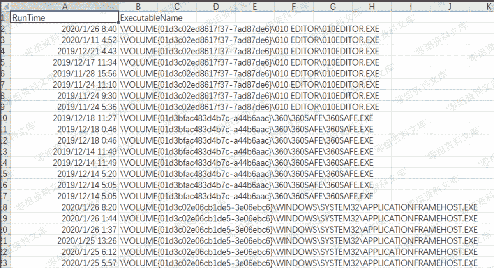

> 原文：[http://book.iwonder.run/安全技术/Windows 取证/11.html](http://book.iwonder.run/安全技术/Windows 取证/11.html)

## Prefetch

> Prefetch 是预读取文件夹，用来存放系统已访问过的文件的预读信息，扩展名为 PF。之所以自动创建 Prefetch 文件夹，是为了加快系统启动的进程。

查看该功能是否开启：

```
reg query "HKEY_LOCAL_MACHINE\SYSTEM\CurrentControlSet\Control\Session Manager\Memory Management\PrefetchParameters" /v EnablePrefetcher 
```

键值代表的含义

```
0 = Disabled
1 = Application launch prefetching enabled
2 = Boot prefetching enabled
3 = Applaunch and Boot enabled (Optimal and Default) 
```

位置为：

**注**：实时更新，数据加密

```
C:\Windows\Prefetch 
```

解析工具:[https://github.com/ianxtianxt/PECmd](https://github.com/ianxtianxt/PECmd)

参数:

```
PECmd.exe -f "C:\Temp\CALC.EXE-3FBEF7FD.pf"
PECmd.exe -f "C:\Temp\CALC.EXE-3FBEF7FD.pf" --json "D:\jsonOutput" --jsonpretty
PECmd.exe -d "C:\Temp" -k "system32, fonts"
PECmd.exe -d "C:\Temp" --csv "c:\temp" --json c:\temp\json
PECmd.exe -d "C:\Windows\Prefetch" 
```

PS：按`csv`导出的有两个文件：`"time_prefix".PECmd_Output.csv`和`"time_prefix".PECmd_Output_Timeline.csv`，前者保存了详情信息，后者只保存了运行时间和可执行程序的名称

`"time_prefix".PECmd_Output_Timeline.csv`的



`"time_prefix".PECmd_Output.csv`


