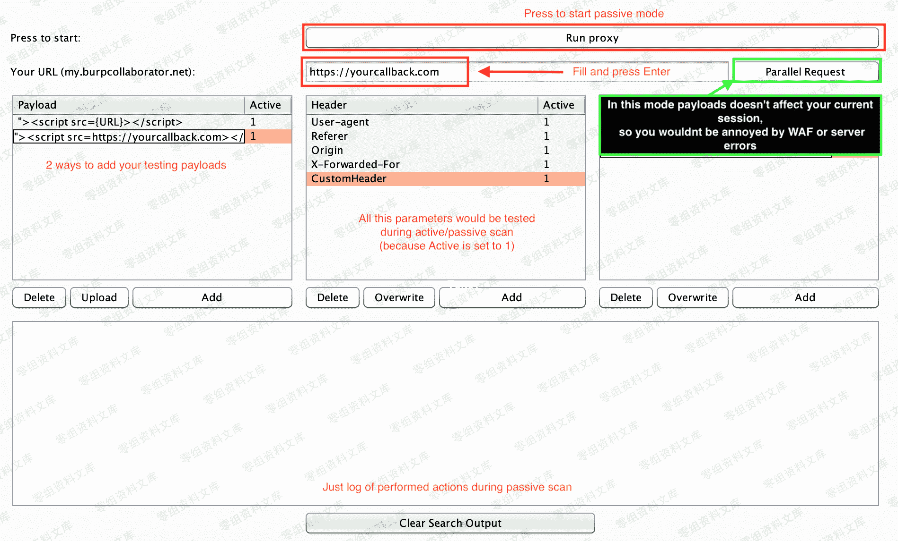

# Burpsuite 自动化 blind-xss 插件

> 原文：[http://book.iwonder.run/Tools/Burpsuite/2.html](http://book.iwonder.run/Tools/Burpsuite/2.html)

[https://github.com/ianxtianxt/Automated-blind-xss-search-for-Burp-Suite](https://github.com/ianxtianxt/Automated-blind-xss-search-for-Burp-Suite)

## 安装

Git clone [https://github.com/ianxtianxt/Automated-blind-xss-search-for-Burp-Suite.git](https://github.com/ianxtianxt/Automated-blind-xss-search-for-Burp-Suite.git)

Burp -> Extender -> Add -> find and select blind-xss.py

## 如何使用

首先，在名为“Your URL”的字段中设置回调 URL，然后按 Enter 将其自动保存在 config.py 文件中。

设置好之后，您需要用 OOB-XSS 向量填充 Payloads 表，以便扩展程序能够将您的 Payloads 注入到传出的请求中。请注意，您需要在 Payloads 中设置{URL}别名，因此扩展名将能够从“Your url”字段中获取数据并将其直接设置为 Payloads。

Femida 是随机驱动的扩展，因此在主动或被动扫描期间，将在行“Active”中使用带有“ 1”的每个 Payloads。因此，如果要从测试中排除任何 Payloads 或参数/标头，只需将“Active”值更改为 0。

## Payloads

*   使用'上传'或'添加'按钮将 Payloads 添加到表中。
*   不要忘记有效载荷中的{URL}参数。
*   当您将任何数据添加到表中时，活动行将手动等于 1.（现在表示其活动状态）
*   如果要使其不活动-将活动行设置为 0

## Headers & Parameters

*   您可以使用添加按钮或在 Target/Proxy/Repeater 中单击鼠标右键手动添加数据。

*   headers 和 parameters 不区分大小写。
*   如果要使其不活动-将活动行设置为 0。

