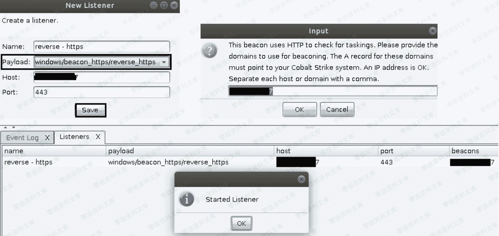
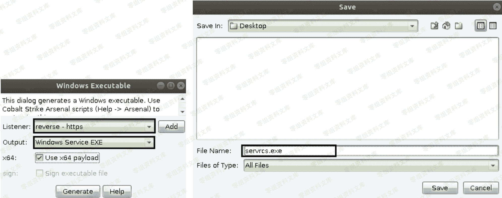
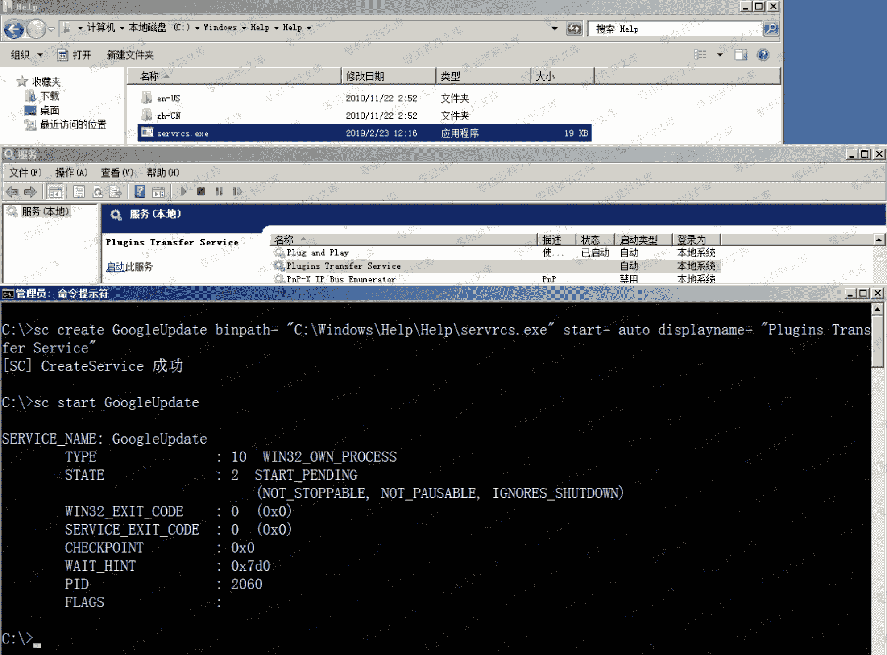
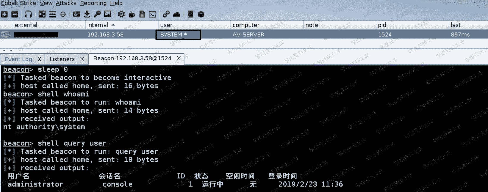
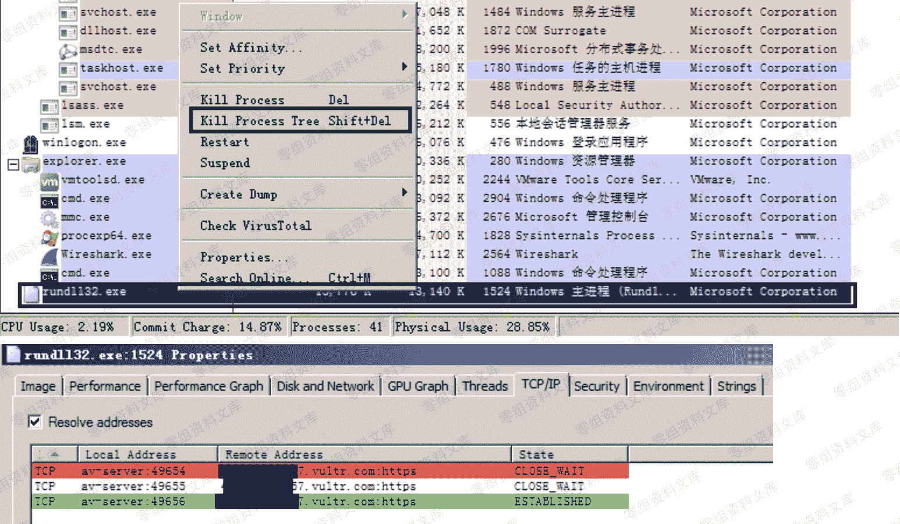
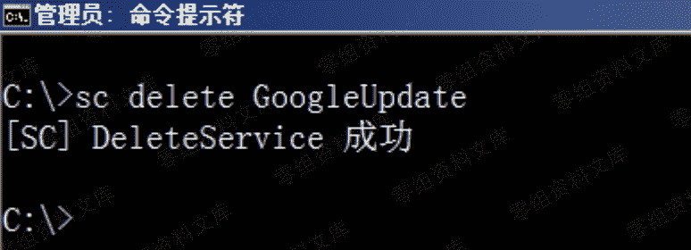

> 原文：[http://book.iwonder.run/Tools/Cobalt Strike/10.html](http://book.iwonder.run/Tools/Cobalt Strike/10.html)

## windows/beacon_https/reverse_https [ 基于 https 协议(加密)的反向连接 ]

> 首先,依然是创建一个 windows/beacon_https/reverse_https 的监听器,具体如下



> 接着,再用如上监听器创建 windows 服务 payload



> 从字面意义上不难理解,所谓 Windows 服务 payload,顾名思义就是以服务的方式启动的 payload,它不同于常规的 exe payload 直接双击即可运行,windows 服务 payload 需要你先用 sc 把它做成系统服务,然后再以服务的方式来启动运行 payload,说白点最终都是在执行某个路径下的 exe,只是调用的方式不通而已,具体操作如下

```
# sc create GoogleUpdate binpath= "C:\Windows\Help\Help\servrcs.exe" start= auto displayname= "Plugins Transfer Service" 创建系统服务
# sc start GoogleUpdate 启动该服务
# sc stop GoogleUpdate 停止该服务
# sc delete GoogleUpdate 删除指定服务,一定要先停止再删除 
```



> 如下,当我们成功启动服务后,便会看到一个 beacon shell 被正常弹回,特别注意下回来的这个 shell 权限,默认以管理员身份创建启动的服务回来的 shell 一般都直接是 system 权限,这也是有别于常规 exe payload 的地方,执行 exe payload 弹回来的 shell 默认只是当前用户的权限,如果当前用户并不是系统管理员或者是一个未被 BypassUAC 的"管理员",那这个 shell 在目标系统中可操作的范围就很窄了,后期还要想办法提权才行



> 然后我们再来简单看下此时的目标系统进程,发现它是利用 rundll32.exe 来执行我们的服务 payload 的,相对于那种 exe payload 直接一个进程大摇大摆的在目标系统里挂着,这种服务启动的方式就要显的隐蔽多了,当然啦,这也仅仅只是相对隐蔽而已,还是很容易被一步定位到



> 很明显,由于此处用的是 https 监听器,从 wireshark 中我们发现此时的回传数据已被全部加密,之所以要用 https,是因为这种方式在某些情况下,穿透性要比 http 稍好一些,一定程度上可防止流量被目标的一些防护设备反向解析,其实,说实话,也并好不到哪里去,另外,同样还是那个问题,直接这样生成的服务 payload 也几乎也是不可能免杀的,所以,此处目的也只仅仅只是为了告诉大家,以后可以用这种方式去执行自己的 payload,但 payload 不一定非要这么生成,希望弟兄们能明白我的意思


> 最后,服务用完以后,记得随手删除



