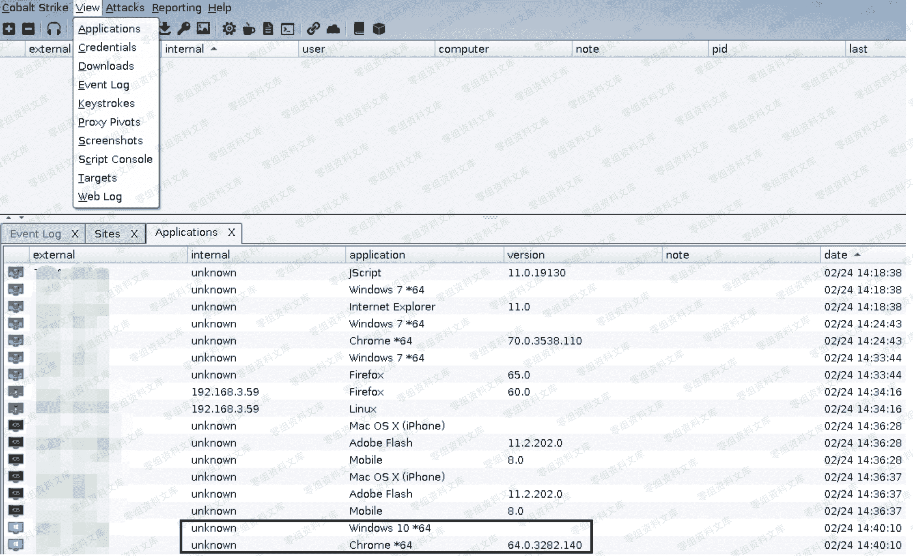

# Cobalt Strike 探针

> 原文：[http://book.iwonder.run/Tools/Cobalt Strike/18.html](http://book.iwonder.run/Tools/Cobalt Strike/18.html)

## 关于探针

> 在开始正式的内容之前,我们不妨先来大致了解下,所谓的探针,到底是个什么东西,首先,来假设这么一种场景,比如,某天一个小偷想"光顾"下你们家, 既然是"光顾"那肯定不能选择有人在家的时候下手,怎么办确定你家到底有没有人在呢? 有个很简单的方式,比如,我去按下你家的门铃,但是按完之后,我立马就远远躲到某个角落里观察,听着到底有没有开门的动静儿,如果有,则说明此时家里有人,不太方便下手,如果陆陆续续敲了几次都发现没人开门,则说明家里很可能没人,这个时候下手就比较保险了,那么这个查点的过程实际上就是"探针"的核心作用
> 
> 此时反过来将这种场景应用到我们实际渗透中,就很好理解了,比如,我现在需要明确的知道目标平时都喜欢用什么系统 详细版本是多少[win7,8 or 10],爱用什么浏览器,常用的办公软件又有哪些,有没有装 flash,版本又是多少,再比如,现在想直接给目标发木马信,我们是不是需要事先明确知道,目标系统都用的什么杀软,这样后期才好针对性的做免杀,还有目标机器处在什么样的内网[一看 172 的内网段,极有可能就是在办公内网],出口 ip 是多少,等等等...具体该怎么去拿到上面所说的这些目标信息呢,一种比较好的方式就是通过探针来搜集,说白点就是想办法让目标去点一下我们事先精心设计好的一个链接,通过伪造某个真实的网站链接,来变相搜集用户敏感信息,当然啦,CobaltStrike 默认的探针能搜集的信息范围非常有限,所以如果你是想真正用于实战,这种东西建议大家最好还是直接自己写

## 探针的利用

> 第一步,先来看看如何利用 CobaltStrike 快速生成一个探针链接,如下,端口保持默认,重定向 url 选择真实网站 url,本地 url 尽量弄的和真实网站 url 像一点,总之,一眼看上去比较有迷惑性才行,最后,把最下面的使用 java applet 获取信息也勾上,因为用 java 获取的稍微更精准一点,没记错的话,默认应该是用 js 来获取的


> 完了之后点击 "Attacks " -> " Web Drive-by" -> "Manage" 便可找到刚刚生成好的探针链接


> 最终,生成的探针链接形式大致如下,由于此处仅为学习,所以用的直接是 ip,实战中肯定是要用自己的域名的

```
http://71.26.83.17/ 
```

> 第二步,假如你就像现在这样直接把探针链接发给人家,别人一看肯定就会起疑心,更别说去点了,所以需要再用短地址稍微伪装下原本的探针链接才行,如下

```
https://bitly.com/ 类似的短地址生成站,还有非常多,大家请自行谷歌,境外目标就直接用境外的短地址生成站,境内的就直接用境内的一些短地址生成站,主要是速度快,不会有所察觉
https://bit.ly/2VUiklp8 
```


> 第三步,就是想尽一切办法潜入目标群组,twitter,facebook,以及各种 QQ 群,朋友圈,站内信或者直接去搜集目标邮箱,总之,只要能把探针地址发给目标就行 [至于具体在实战中如何想办法跟目标搭上线,不是此处要关注的重点,也就不多啰嗦了],当目标一点这个地址,首先,它会通过短域名解析到我们自己的探针链接上,然后在探针链接上可能要停顿个一秒的样子再跳转到真实的网站链接上,如果此时目标网速够快的话,停顿的这个过程几乎是不会有太大感觉的


> 如下便是当目标正常点击了我们发给他的探针之后的效果,此时通过 CobaltStrike 可以清晰的看到获取的目标客户端的各种信息,比如, 公网,内网 ip [linux 系统可以获取到,windows 系统获取的不太准确 ],以及所用浏览器,操作系统的 [ 这个识别的也不太准 ] 详细版本,当然啦,CobaltStrike 本身获取到的信息还是非常有限的,拿到了这些基础信息之后,我们便可以开始进一步针对性的调试自己的马以及其它的各种工具



